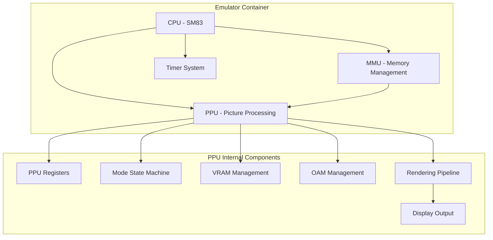

# PPU Technical Architecture - Complete System Design

**Document Version**: 1.0  
**Created**: 2025-08-11  
**Purpose**: Complete system design documentation for PPU implementation  
**Target Audience**: Backend TypeScript Engineer, Architecture Reviewer, Tech Lead  
**Prerequisites**: `/home/pittm/karimono-v2/docs/PPU_PROJECT_OVERVIEW.md`

## Architecture Overview

### System Integration Context

The PPU (Picture Processing Unit) represents the final major component in our Game Boy DMG emulator architecture, integrating with existing CPU, MMU, and Timer systems to provide complete graphics rendering functionality. The architecture maintains our established principles of component encapsulation, single responsibility, and hardware accuracy.



### Component Responsibility Matrix

| Component | Primary Responsibility | Integration Points | Performance Critical |
|-----------|----------------------|-------------------|-------------------|
| PPU Core | State machine coordination | CPU (cycles), MMU (memory) | Yes - 70,224 cycles/frame |
| VRAM Manager | Tile data and maps | MMU (address routing) | Yes - Mode 3 access |
| OAM Manager | Sprite attributes | MMU (DMA), CPU (interrupts) | Yes - 10 sprites/scanline |
| Renderer | Pixel generation | Display (frame buffer) | Yes - 160×144 pixels |
| Register Bank | Hardware registers | CPU (I/O), MMU (mapping) | Medium - register access |

## PPU Core Architecture

### State Machine Design

The PPU operates as a finite state machine with four distinct modes, each with specific timing requirements and memory access characteristics.

```typescript
enum PPUMode {
  HBlank = 0,        // Mode 0: CPU can access VRAM/OAM
  VBlank = 1,        // Mode 1: CPU can access VRAM/OAM  
  OAMSearch = 2,     // Mode 2: CPU blocked from OAM
  PixelTransfer = 3  // Mode 3: CPU blocked from VRAM/OAM
}

interface PPUState {
  readonly currentMode: PPUMode;
  readonly currentScanline: number;    // 0-153
  readonly scanlineCycle: number;      // 0-455
  readonly frameCycle: number;         // 0-70223
  readonly isFrameReady: boolean;
}
```

### Mode Transition Timing

```typescript
class PPUStateMachine {
  // Mode timing constants (in CPU cycles)
  private static readonly MODE_2_CYCLES = 80;          // OAM Search - fixed
  private static readonly MODE_3_BASE_CYCLES = 172;    // Pixel Transfer - base
  private static readonly MODE_3_MAX_CYCLES = 289;     // Pixel Transfer - maximum
  private static readonly SCANLINE_CYCLES = 456;       // Total per scanline
  private static readonly VBLANK_SCANLINES = 10;       // Scanlines 144-153
  private static readonly VISIBLE_SCANLINES = 144;     // Scanlines 0-143

  step(cycles: number): PPUEvents {
    this.scanlineCycle += cycles;
    
    // Handle mode transitions based on timing
    if (this.currentScanline < VISIBLE_SCANLINES) {
      this.handleVisibleScanline();
    } else {
      this.handleVBlankScanline();
    }
    
    return this.generateEvents();
  }
}
```

### Memory Access Control Architecture

Memory access control forms the foundation of hardware-accurate PPU behavior, ensuring CPU memory access restrictions match real DMG behavior.

```typescript
interface MemoryAccessController {
  // VRAM access (0x8000-0x9FFF)
  isVRAMAccessible(): boolean;
  readVRAM(address: number): number;
  writeVRAM(address: number, value: number): void;
  
  // OAM access (0xFE00-0xFE9F)  
  isOAMAccessible(): boolean;
  readOAM(address: number): number;
  writeOAM(address: number, value: number): void;
}

class PPUMemoryController implements MemoryAccessController {
  private vram = new Uint8Array(0x2000);  // 8KB VRAM
  private oam = new Uint8Array(0x00A0);   // 160 bytes OAM
  
  isVRAMAccessible(): boolean {
    // VRAM blocked during Mode 3 (Pixel Transfer)
    return this.currentMode !== PPUMode.PixelTransfer;
  }
  
  isOAMAccessible(): boolean {
    // OAM blocked during Mode 2 (OAM Search) and Mode 3 (Pixel Transfer)
    // Also blocked during DMA transfer
    return this.currentMode !== PPUMode.OAMSearch && 
           this.currentMode !== PPUMode.PixelTransfer &&
           !this.dmaActive;
  }
  
  readVRAM(address: number): number {
    if (!this.isVRAMAccessible()) {
      return 0xFF; // Hardware behavior: blocked reads return 0xFF
    }
    return this.vram[address - 0x8000];
  }
  
  writeVRAM(address: number, value: number): void {
    if (!this.isVRAMAccessible()) {
      return; // Hardware behavior: blocked writes ignored
    }
    this.vram[address - 0x8000] = value;
  }
}
```

## Rendering Pipeline Architecture

### Scanline-Based Rendering Approach

The rendering pipeline processes one scanline at a time, mixing background, window, and sprite layers according to Game Boy priority rules.

```typescript
interface RenderingPipeline {
  renderScanline(scanline: number): void;
  getFrameBuffer(): Uint8Array; // 160×144 pixels, 2-bit color indices
  isFrameComplete(): boolean;
}

class PPURenderer implements RenderingPipeline {
  private frameBuffer = new Uint8Array(160 * 144);
  private currentScanline = 0;
  
  renderScanline(scanline: number): void {
    // 1. Render background layer
    const backgroundPixels = this.renderBackground(scanline);
    
    // 2. Render window layer (if enabled and conditions met)
    const windowPixels = this.renderWindow(scanline);
    
    // 3. Render sprite layer
    const spritePixels = this.renderSprites(scanline);
    
    // 4. Mix layers according to priority rules
    const finalPixels = this.mixLayers(backgroundPixels, windowPixels, spritePixels);
    
    // 5. Write to frame buffer
    this.writeToFrameBuffer(scanline, finalPixels);
  }
}
```

### Layer Rendering Implementation

#### Background Layer Rendering

```typescript
class BackgroundRenderer {
  renderBackground(scanline: number): Uint8Array {
    const pixels = new Uint8Array(160);
    
    for (let x = 0; x < 160; x++) {
      // Calculate effective coordinates with scrolling
      const effectiveX = (x + this.registers.SCX) & 0xFF;
      const effectiveY = (scanline + this.registers.SCY) & 0xFF;
      
      // Calculate tile position in tile map
      const tileX = effectiveX >> 3;
      const tileY = effectiveY >> 3;
      const tileMapAddress = this.getBackgroundTileMapBase() + (tileY << 5) + tileX;
      
      // Fetch tile index
      const tileIndex = this.vram[tileMapAddress - 0x8000];
      
      // Calculate tile data address
      const tileDataAddress = this.calculateTileDataAddress(tileIndex);
      
      // Extract pixel color
      const pixelX = effectiveX & 7;
      const pixelY = effectiveY & 7;
      const colorIndex = this.extractPixelColor(tileDataAddress, pixelX, pixelY);
      
      pixels[x] = colorIndex;
    }
    
    return pixels;
  }
  
  private calculateTileDataAddress(tileIndex: number): number {
    if (this.registers.LCDC & 0x10) {
      // Unsigned addressing: 0x8000-0x8FFF
      return 0x8000 + (tileIndex << 4);
    } else {
      // Signed addressing: 0x8800-0x97FF, base at 0x9000
      const signedIndex = tileIndex < 128 ? tileIndex : tileIndex - 256;
      return 0x9000 + (signedIndex << 4);
    }
  }
}
```

#### Sprite Rendering System

```typescript
interface SpriteAttributes {
  y: number;      // Y position (screen position = y - 16)
  x: number;      // X position (screen position = x - 8)  
  tileIndex: number;
  attributes: number; // Priority, flip flags, palette selection
}

class SpriteRenderer {
  private selectedSprites: SpriteAttributes[] = [];
  
  // Called during Mode 2 (OAM Search)
  selectSpritesForScanline(scanline: number): void {
    this.selectedSprites = [];
    const spriteHeight = (this.registers.LCDC & 0x04) ? 16 : 8;
    
    // Scan all 40 sprites in OAM
    for (let i = 0; i < 40; i++) {
      const sprite = this.readSpriteFromOAM(i);
      
      // Check if sprite overlaps current scanline
      if (scanline >= sprite.y - 16 && 
          scanline < sprite.y - 16 + spriteHeight) {
        
        this.selectedSprites.push(sprite);
        
        // Hardware limit: maximum 10 sprites per scanline
        if (this.selectedSprites.length >= 10) {
          break;
        }
      }
    }
  }
  
  // Called during Mode 3 (Pixel Transfer)
  renderSprites(scanline: number): Uint8Array {
    const pixels = new Uint8Array(160);
    
    // Process sprites in reverse priority order (highest priority last)
    for (let i = this.selectedSprites.length - 1; i >= 0; i--) {
      const sprite = this.selectedSprites[i];
      this.renderSprite(sprite, scanline, pixels);
    }
    
    return pixels;
  }
}
```

### Performance Optimization Strategies

#### Direct Memory Access for Hot Paths

```typescript
class OptimizedRenderer {
  // Pre-allocated buffers to avoid garbage collection
  private backgroundCache = new Uint8Array(160);
  private spriteCache = new Uint8Array(160);
  private windowCache = new Uint8Array(160);
  
  // Lookup tables for frequently used calculations
  private static readonly TILE_DATA_ADDRESSES = OptimizedRenderer.generateTileAddressLookup();
  private static readonly PIXEL_MASKS = OptimizedRenderer.generatePixelMasks();
  
  renderScanlineOptimized(scanline: number): void {
    // Use pre-allocated buffers
    this.backgroundCache.fill(0);
    this.spriteCache.fill(0);
    this.windowCache.fill(0);
    
    // Direct memory access without function call overhead
    const vramBase = this.vram;
    const frameBufferBase = this.frameBuffer;
    const scanlineOffset = scanline * 160;
    
    // Optimized pixel loop with minimal branching
    for (let x = 0; x < 160; x++) {
      const bgPixel = this.getBackgroundPixelDirect(x, scanline, vramBase);
      const spritePixel = this.getSpritePixelDirect(x, scanline);
      const finalPixel = this.mixPixelsDirect(bgPixel, spritePixel);
      
      frameBufferBase[scanlineOffset + x] = finalPixel;
    }
  }
}
```

## Register Architecture

### Complete Register Implementation

```typescript
interface PPURegisters {
  // Display control registers
  LCDC: number;    // 0xFF40 - LCD Control
  STAT: number;    // 0xFF41 - LCD Status
  
  // Scroll registers
  SCY: number;     // 0xFF42 - Scroll Y
  SCX: number;     // 0xFF43 - Scroll X
  
  // Position registers
  LY: number;      // 0xFF44 - Current scanline (read-only)
  LYC: number;     // 0xFF45 - Scanline compare
  
  // Palette registers (DMG)
  BGP: number;     // 0xFF47 - Background palette
  OBP0: number;    // 0xFF48 - Object palette 0
  OBP1: number;    // 0xFF49 - Object palette 1
  
  // Window position registers
  WY: number;      // 0xFF4A - Window Y position
  WX: number;      // 0xFF4B - Window X position
  
  // DMA register
  DMA: number;     // 0xFF46 - OAM DMA transfer
}

class PPURegisterBank implements PPURegisters {
  // Register storage
  private registers = new Uint8Array(12);
  
  // Register address mapping
  private static readonly REGISTER_MAP = new Map<number, number>([
    [0xFF40, 0], // LCDC
    [0xFF41, 1], // STAT
    [0xFF42, 2], // SCY
    [0xFF43, 3], // SCX
    [0xFF44, 4], // LY
    [0xFF45, 5], // LYC
    [0xFF46, 6], // DMA
    [0xFF47, 7], // BGP
    [0xFF48, 8], // OBP0
    [0xFF49, 9], // OBP1
    [0xFF4A, 10], // WY
    [0xFF4B, 11], // WX
  ]);
  
  readRegister(address: number): number {
    const index = PPURegisterBank.REGISTER_MAP.get(address);
    if (index === undefined) {
      throw new Error(`Invalid PPU register address: 0x${address.toString(16)}`);
    }
    
    // Special handling for read-only registers
    if (address === 0xFF44) {
      return this.currentScanline; // LY is read-only
    }
    
    return this.registers[index];
  }
  
  writeRegister(address: number, value: number): void {
    const index = PPURegisterBank.REGISTER_MAP.get(address);
    if (index === undefined) {
      throw new Error(`Invalid PPU register address: 0x${address.toString(16)}`);
    }
    
    // Special handling for specific registers
    if (address === 0xFF44) {
      return; // LY is read-only, writes ignored
    }
    
    if (address === 0xFF41) {
      // STAT register: preserve read-only bits
      this.handleSTATWrite(value);
      return;
    }
    
    if (address === 0xFF46) {
      // DMA register: trigger OAM DMA transfer
      this.triggerDMATransfer(value);
      return;
    }
    
    this.registers[index] = value;
  }
}
```

### Register Behavior Implementation

#### STAT Register Special Handling

```typescript
class STATRegisterController {
  private statRegister = 0;
  private statInterruptLine = false;
  
  handleSTATWrite(value: number): void {
    // Preserve read-only bits (bits 0-2: mode and LYC=LY flag)
    const readOnlyMask = 0x07;
    const writableMask = 0xF8;
    
    this.statRegister = (this.statRegister & readOnlyMask) | (value & writableMask);
    
    // DMG Bug: Writing to STAT can trigger spurious interrupts
    // This occurs when interrupt conditions are already met
    if (this.isSTATInterruptConditionMet()) {
      this.requestSTATInterrupt();
    }
  }
  
  updateModeInSTAT(mode: PPUMode): void {
    this.statRegister = (this.statRegister & 0xFC) | mode;
    this.checkSTATInterrupts();
  }
  
  updateLYCComparison(ly: number, lyc: number): void {
    if (ly === lyc) {
      this.statRegister |= 0x04; // Set LYC=LY flag
    } else {
      this.statRegister &= ~0x04; // Clear LYC=LY flag
    }
    this.checkSTATInterrupts();
  }
}
```

## Integration Architecture

### MMU Integration Points

```typescript
interface MMUIntegration {
  // Address routing to PPU components
  routePPUMemoryAccess(address: number, isWrite: boolean): boolean;
  
  // Memory access coordination
  handleVRAMAccess(address: number, value?: number): number | void;
  handleOAMAccess(address: number, value?: number): number | void;
  handleRegisterAccess(address: number, value?: number): number | void;
}

class MMUPPUIntegration implements MMUIntegration {
  constructor(private ppu: PPU) {}
  
  routePPUMemoryAccess(address: number, isWrite: boolean): boolean {
    // VRAM range: 0x8000-0x9FFF
    if (address >= 0x8000 && address <= 0x9FFF) {
      return true;
    }
    
    // OAM range: 0xFE00-0xFE9F
    if (address >= 0xFE00 && address <= 0xFE9F) {
      return true;
    }
    
    // PPU register range: 0xFF40-0xFF4B
    if (address >= 0xFF40 && address <= 0xFF4B) {
      return true;
    }
    
    return false;
  }
  
  handleVRAMAccess(address: number, value?: number): number | void {
    if (value !== undefined) {
      // Write operation
      this.ppu.writeVRAM(address, value);
    } else {
      // Read operation
      return this.ppu.readVRAM(address);
    }
  }
}
```

### CPU Coordination Architecture

```typescript
interface CPUCoordination {
  // Cycle coordination
  stepPPU(cycles: number): PPUEvents;
  
  // Interrupt handling
  handlePPUInterrupts(events: PPUEvents): void;
  
  // Memory access coordination
  checkMemoryAccess(address: number): boolean;
}

class CPUPPUCoordination implements CPUCoordination {
  constructor(
    private cpu: CPU,
    private ppu: PPU,
    private interruptController: InterruptController
  ) {}
  
  stepPPU(cycles: number): PPUEvents {
    const events = this.ppu.step(cycles);
    this.handlePPUInterrupts(events);
    return events;
  }
  
  handlePPUInterrupts(events: PPUEvents): void {
    if (events.vblankInterrupt) {
      this.interruptController.requestInterrupt(InterruptType.VBlank);
    }
    
    if (events.statInterrupt) {
      this.interruptController.requestInterrupt(InterruptType.STAT);
    }
  }
}
```

## Performance Architecture

### Timing Requirements and Optimization

```typescript
interface PerformanceRequirements {
  readonly FRAME_CYCLES: 70224;        // Total cycles per frame
  readonly TARGET_FPS: 59.7;           // Target frame rate
  readonly CYCLE_TIME_NS: 238.4;       // Nanoseconds per cycle (4.194304 MHz)
  readonly MAX_FRAME_TIME_MS: 16.75;   // Maximum frame time (1000ms / 59.7fps)
}

class PerformanceOptimizer {
  private frameTimings: number[] = [];
  private cycleAccumulator = 0;
  
  optimizeForTargetFrameRate(): void {
    // Pre-compute lookup tables
    this.precomputeTileAddresses();
    this.precomputePixelMasks();
    
    // Optimize memory access patterns
    this.enableDirectBufferAccess();
    
    // Configure rendering pipeline for performance
    this.configureScanlineBuffering();
  }
  
  measureFramePerformance(startTime: number, endTime: number): void {
    const frameTime = endTime - startTime;
    this.frameTimings.push(frameTime);
    
    // Keep rolling window of last 60 frames
    if (this.frameTimings.length > 60) {
      this.frameTimings.shift();
    }
    
    // Alert if performance drops below target
    if (frameTime > PerformanceRequirements.MAX_FRAME_TIME_MS) {
      console.warn(`Frame time exceeded target: ${frameTime.toFixed(2)}ms`);
    }
  }
}
```

### Memory Layout Optimization

```typescript
class OptimizedMemoryLayout {
  // Aligned memory structures for cache efficiency
  private readonly vram = new ArrayBuffer(0x2000);
  private readonly vramView = new Uint8Array(this.vram);
  private readonly vramWords = new Uint32Array(this.vram);
  
  private readonly oam = new ArrayBuffer(0x00A0);
  private readonly oamView = new Uint8Array(this.oam);
  private readonly oamSprites = new Uint32Array(this.oam);
  
  // Optimize tile data access with word-aligned reads
  readTileData(tileAddress: number): [number, number] {
    const wordIndex = (tileAddress - 0x8000) >> 2;
    const tileWord = this.vramWords[wordIndex];
    
    // Extract two bytes from word
    const byte0 = tileWord & 0xFF;
    const byte1 = (tileWord >> 8) & 0xFF;
    
    return [byte0, byte1];
  }
  
  // Optimize sprite attribute access
  readSpriteAttributes(spriteIndex: number): SpriteAttributes {
    const wordIndex = spriteIndex;
    const spriteWord = this.oamSprites[wordIndex];
    
    return {
      y: spriteWord & 0xFF,
      x: (spriteWord >> 8) & 0xFF,
      tileIndex: (spriteWord >> 16) & 0xFF,
      attributes: (spriteWord >> 24) & 0xFF,
    };
  }
}
```

## Error Handling and Diagnostics

### Comprehensive Error Handling Strategy

```typescript
enum PPUErrorType {
  InvalidRegisterAccess = 'INVALID_REGISTER_ACCESS',
  MemoryAccessViolation = 'MEMORY_ACCESS_VIOLATION',
  TimingViolation = 'TIMING_VIOLATION',
  RenderingError = 'RENDERING_ERROR',
  StateMachineError = 'STATE_MACHINE_ERROR',
}

class PPUErrorHandler {
  private errorCount = 0;
  private errorHistory: PPUError[] = [];
  
  handleError(type: PPUErrorType, context: any, recoverable: boolean): void {
    const error = new PPUError(type, context, recoverable);
    this.errorHistory.push(error);
    this.errorCount++;
    
    if (recoverable) {
      this.attemptRecovery(error);
    } else {
      throw error;
    }
  }
  
  private attemptRecovery(error: PPUError): void {
    switch (error.type) {
      case PPUErrorType.InvalidRegisterAccess:
        // Log and ignore invalid register access
        console.warn(`Invalid PPU register access: ${error.context.address}`);
        break;
        
      case PPUErrorType.MemoryAccessViolation:
        // Return 0xFF for blocked reads, ignore blocked writes
        console.warn(`PPU memory access blocked: ${error.context.address}`);
        break;
        
      case PPUErrorType.TimingViolation:
        // Adjust timing to maintain frame rate
        console.warn(`PPU timing violation: ${error.context.expectedCycles}`);
        this.adjustTiming();
        break;
    }
  }
}
```

### Diagnostic and Debug Support

```typescript
interface PPUDiagnostics {
  // Performance monitoring
  getPerformanceStats(): PerformanceStats;
  getTimingStats(): TimingStats;
  
  // State inspection
  getCurrentState(): PPUState;
  getRegisterDump(): RegisterDump;
  getMemoryDump(type: 'vram' | 'oam'): Uint8Array;
  
  // Debugging support
  enableTracing(enabled: boolean): void;
  getExecutionTrace(): TraceEntry[];
}

class PPUDiagnosticSystem implements PPUDiagnostics {
  private performanceStats = new PerformanceStatsCollector();
  private executionTracer = new ExecutionTracer();
  private stateSnapshot = new StateSnapshotManager();
  
  getPerformanceStats(): PerformanceStats {
    return {
      averageFrameTime: this.performanceStats.getAverageFrameTime(),
      frameRate: this.performanceStats.getCurrentFrameRate(),
      cycleAccuracy: this.performanceStats.getCycleAccuracy(),
      memoryEfficiency: this.performanceStats.getMemoryEfficiency(),
    };
  }
  
  getCurrentState(): PPUState {
    return {
      currentMode: this.ppu.getCurrentMode(),
      currentScanline: this.ppu.getCurrentScanline(),
      scanlineCycle: this.ppu.getScanlineCycle(),
      frameCycle: this.ppu.getFrameCycle(),
      isFrameReady: this.ppu.isFrameReady(),
      vramAccessible: this.ppu.isVRAMAccessible(),
      oamAccessible: this.ppu.isOAMAccessible(),
    };
  }
}
```

## Conclusion

The PPU technical architecture provides a comprehensive foundation for implementing hardware-accurate Game Boy graphics functionality within our existing emulator framework. The design prioritizes:

1. **Hardware Accuracy**: Cycle-accurate timing and proper memory access restrictions
2. **Performance Optimization**: Direct memory access and optimized rendering pipelines
3. **System Integration**: Clean interfaces with CPU, MMU, and Timer components
4. **Maintainability**: Clear component boundaries and comprehensive error handling
5. **Testability**: Observable behavior at component boundaries for validation

The architecture supports the complete PPU feature set while maintaining compatibility with our established engineering principles and performance requirements. Implementation can proceed incrementally using the phase-based approach outlined in the project overview.

---

**Next Document**: `/home/pittm/karimono-v2/docs/PPU_IMPLEMENTATION_GUIDE.md` - Step-by-step development guidance  
**Related Files**: 
- `/home/pittm/karimono-v2/docs/hardware/ppu-comprehensive-specification.md` - Hardware specifications
- `/home/pittm/karimono-v2/docs/hardware/ppu-integration-requirements.md` - Integration requirements
- `/home/pittm/karimono-v2/docs/architecture/component-architecture.md` - Overall system architecture