# PPU Implementation Guide - Step-by-Step Development

**Document Version**: 1.0  
**Created**: 2025-08-11  
**Purpose**: Step-by-step implementation guidance for PPU development team  
**Target Audience**: Backend TypeScript Engineer, Frontend Vite Engineer, Implementation Team  
**Prerequisites**: `/home/pittm/karimono-v2/docs/PPU_TECHNICAL_ARCHITECTURE.md`

## Implementation Strategy Overview

### Development Approach

The PPU implementation follows our established TDD (Test-Driven Development) workflow with incremental integration and hardware validation. Each phase builds upon the previous, ensuring stable progress and early validation against known-good baselines.

### Phase-Based Implementation Plan

```mermaid
gantt
    title PPU Implementation Timeline
    dateFormat  X
    axisFormat %d
    
    section Phase 1 - Infrastructure
    Component Structure    :phase1a, 0, 3d
    Register Framework     :phase1b, after phase1a, 2d
    State Machine Basic    :phase1c, after phase1b, 3d
    
    section Phase 2 - Memory System
    VRAM Management       :phase2a, after phase1c, 2d
    OAM Management        :phase2b, after phase2a, 2d
    Memory Access Control :phase2c, after phase2b, 3d
    
    section Phase 3 - Rendering Core
    Background Rendering  :phase3a, after phase2c, 4d
    Window Implementation :phase3b, after phase3a, 3d
    Sprite System        :phase3c, after phase3b, 4d
    
    section Phase 4 - Integration
    MMU Integration      :phase4a, after phase3c, 2d
    CPU Coordination     :phase4b, after phase4a, 2d
    Display Pipeline     :phase4c, after phase4b, 3d
    
    section Phase 5 - Validation
    Mealybug Testing     :phase5a, after phase4c, 5d
    Performance Tuning   :phase5b, after phase5a, 3d
    Final Integration    :phase5c, after phase5b, 2d
```



## Phase 1: Core Infrastructure Implementation

### Step 1.1: PPU Component Structure

Create the foundational PPU component with basic structure and interfaces.

#### File Structure Setup

```bash
# Create PPU component files
mkdir -p src/emulator/display/ppu
touch src/emulator/display/ppu/PPU.ts
touch src/emulator/display/ppu/PPURegisters.ts
touch src/emulator/display/ppu/PPUStateMachine.ts
touch src/emulator/display/ppu/index.ts

# Create test files
mkdir -p tests/emulator/display/ppu
touch tests/emulator/display/ppu/PPU.test.ts
touch tests/emulator/display/ppu/PPURegisters.test.ts
touch tests/emulator/display/ppu/PPUStateMachine.test.ts
```

#### PPU Core Interface Implementation

```typescript
// src/emulator/display/ppu/PPU.ts

/**
 * PPU Core Implementation - Game Boy DMG Picture Processing Unit
 * 
 * Implements cycle-accurate PPU behavior including:
 * - Four-mode state machine (HBlank, VBlank, OAM Search, Pixel Transfer)
 * - Hardware-accurate memory access restrictions
 * - Background, window, and sprite rendering
 * - Interrupt generation (VBlank, STAT)
 * 
 * Reference: RGBDS GBZ80 Reference https://rgbds.gbdev.io/docs/v0.9.4/gbz80.7
 * Hardware Validation: Mealybug Tearoom test ROMs
 */

import { PPURegisters } from './PPURegisters';
import { PPUStateMachine, PPUMode, PPUEvents } from './PPUStateMachine';

export interface PPU {
  // Core execution
  step(cycles: number): PPUEvents;
  reset(): void;
  
  // Memory access (mode-aware)
  readVRAM(address: number): number;
  writeVRAM(address: number, value: number): void;
  readOAM(address: number): number;
  writeOAM(address: number, value: number): void;
  
  // Register access
  readRegister(address: number): number;
  writeRegister(address: number, value: number): void;
  
  // Display output
  getFrameBuffer(): Uint8Array; // 160×144 2-bit pixels
  isFrameReady(): boolean;
  acknowledgeFrame(): void;
  
  // State queries
  getCurrentMode(): PPUMode;
  getCurrentScanline(): number;
  getScanlineCycle(): number;
  getFrameCycle(): number;
  
  // Memory access control
  isVRAMAccessible(): boolean;
  isOAMAccessible(): boolean;
  isDMAActive(): boolean;
}

export class PPUImpl implements PPU {
  private registers: PPURegisters;
  private stateMachine: PPUStateMachine;
  
  // Memory storage
  private vram = new Uint8Array(0x2000);  // 8KB VRAM
  private oam = new Uint8Array(0x00A0);   // 160 bytes OAM
  
  // Display output
  private frameBuffer = new Uint8Array(160 * 144);
  private frameReady = false;
  
  // DMA state
  private dmaActive = false;
  private dmaSourceAddress = 0;
  private dmaBytesRemaining = 0;
  
  constructor() {
    this.registers = new PPURegisters();
    this.stateMachine = new PPUStateMachine(this.registers);
  }
  
  step(cycles: number): PPUEvents {
    const events = this.stateMachine.step(cycles);
    
    // Handle DMA transfer if active
    if (this.dmaActive) {
      this.processDMATransfer(cycles);
    }
    
    // Update frame ready status
    if (events.frameComplete && !this.frameReady) {
      this.frameReady = true;
    }
    
    return events;
  }
  
  reset(): void {
    this.registers.reset();
    this.stateMachine.reset();
    this.vram.fill(0);
    this.oam.fill(0);
    this.frameBuffer.fill(0);
    this.frameReady = false;
    this.dmaActive = false;
  }
  
  // Memory access implementation
  readVRAM(address: number): number {
    if (!this.isVRAMAccessible()) {
      return 0xFF; // Hardware behavior: blocked reads return 0xFF
    }
    return this.vram[address - 0x8000];
  }
  
  writeVRAM(address: number, value: number): void {
    if (!this.isVRAMAccessible()) {
      return; // Hardware behavior: blocked writes ignored
    }
    this.vram[address - 0x8000] = value;
  }
  
  isVRAMAccessible(): boolean {
    // VRAM blocked during Mode 3 (Pixel Transfer)
    return this.getCurrentMode() !== PPUMode.PixelTransfer;
  }
  
  isOAMAccessible(): boolean {
    const mode = this.getCurrentMode();
    return mode !== PPUMode.OAMSearch && 
           mode !== PPUMode.PixelTransfer && 
           !this.dmaActive;
  }
  
  getCurrentMode(): PPUMode {
    return this.stateMachine.getCurrentMode();
  }
  
  getCurrentScanline(): number {
    return this.stateMachine.getCurrentScanline();
  }
  
  getScanlineCycle(): number {
    return this.stateMachine.getScanlineCycle();
  }
  
  getFrameCycle(): number {
    return this.stateMachine.getFrameCycle();
  }
  
  getFrameBuffer(): Uint8Array {
    return this.frameBuffer;
  }
  
  isFrameReady(): boolean {
    return this.frameReady;
  }
  
  acknowledgeFrame(): void {
    this.frameReady = false;
  }
  
  isDMAActive(): boolean {
    return this.dmaActive;
  }
}
```

#### Test-Driven Implementation

```typescript
// tests/emulator/display/ppu/PPU.test.ts

import { PPUImpl, PPUMode } from '../../../../src/emulator/display/ppu/PPU';

describe('PPU Core Implementation', () => {
  let ppu: PPUImpl;
  
  beforeEach(() => {
    ppu = new PPUImpl();
  });
  
  describe('Initialization', () => {
    it('should initialize with correct default state', () => {
      expect(ppu.getCurrentMode()).toBe(PPUMode.OAMSearch);
      expect(ppu.getCurrentScanline()).toBe(0);
      expect(ppu.getScanlineCycle()).toBe(0);
      expect(ppu.getFrameCycle()).toBe(0);
      expect(ppu.isFrameReady()).toBe(false);
    });
    
    it('should have accessible VRAM and blocked OAM in initial state', () => {
      expect(ppu.isVRAMAccessible()).toBe(true);
      expect(ppu.isOAMAccessible()).toBe(false); // Mode 2 blocks OAM
    });
  });
  
  describe('Memory Access Control', () => {
    it('should block VRAM access during Mode 3 (Pixel Transfer)', () => {
      // Force PPU into Mode 3
      // Note: This will be implemented when state machine is complete
      // For now, test the interface exists
      expect(typeof ppu.isVRAMAccessible()).toBe('boolean');
    });
    
    it('should return 0xFF for blocked VRAM reads', () => {
      // Write test data to VRAM
      ppu.writeVRAM(0x8000, 0x42);
      
      // Force into blocked state (Mode 3)
      // Implementation depends on state machine
      
      // Verify blocked read returns 0xFF
      // This test will be completed in Phase 2
    });
  });
  
  describe('Frame Buffer Management', () => {
    it('should provide 160x144 frame buffer', () => {
      const frameBuffer = ppu.getFrameBuffer();
      expect(frameBuffer.length).toBe(160 * 144);
      expect(frameBuffer).toBeInstanceOf(Uint8Array);
    });
    
    it('should initialize frame buffer to zero', () => {
      const frameBuffer = ppu.getFrameBuffer();
      expect(frameBuffer.every(pixel => pixel === 0)).toBe(true);
    });
  });
});
```

### Step 1.2: PPU Registers Implementation

Implement the complete PPU register bank with hardware-accurate behavior.

```typescript
// src/emulator/display/ppu/PPURegisters.ts

/**
 * PPU Register Bank - Hardware-accurate Game Boy DMG PPU registers
 * 
 * Implements all PPU registers with proper read/write behavior:
 * - LCDC (0xFF40): LCD Control register
 * - STAT (0xFF41): LCD Status register with special write behavior
 * - Scroll registers: SCY, SCX
 * - Position registers: LY (read-only), LYC
 * - Palette registers: BGP, OBP0, OBP1
 * - Window position: WY, WX
 * - DMA register: DMA transfer trigger
 */

export class PPURegisters {
  // Register storage (12 registers)
  private registers = new Uint8Array(12);
  
  // Register address mapping
  private static readonly LCDC_INDEX = 0;   // 0xFF40
  private static readonly STAT_INDEX = 1;   // 0xFF41
  private static readonly SCY_INDEX = 2;    // 0xFF42
  private static readonly SCX_INDEX = 3;    // 0xFF43
  private static readonly LY_INDEX = 4;     // 0xFF44 (read-only)
  private static readonly LYC_INDEX = 5;    // 0xFF45
  private static readonly DMA_INDEX = 6;    // 0xFF46
  private static readonly BGP_INDEX = 7;    // 0xFF47
  private static readonly OBP0_INDEX = 8;   // 0xFF48
  private static readonly OBP1_INDEX = 9;   // 0xFF49
  private static readonly WY_INDEX = 10;    // 0xFF4A
  private static readonly WX_INDEX = 11;    // 0xFF4B
  
  // Special state tracking
  private currentScanline = 0;
  private statInterruptLine = false;
  
  constructor() {
    this.reset();
  }
  
  reset(): void {
    // Initialize registers to power-on state
    this.registers.fill(0);
    
    // Set default values
    this.registers[PPURegisters.LCDC_INDEX] = 0x91;  // LCD on, BG on
    this.registers[PPURegisters.BGP_INDEX] = 0xFC;   // Background palette
    this.registers[PPURegisters.OBP0_INDEX] = 0xFF;  // Object palette 0
    this.registers[PPURegisters.OBP1_INDEX] = 0xFF;  // Object palette 1
    
    this.currentScanline = 0;
    this.statInterruptLine = false;
  }
  
  read(address: number): number {
    switch (address) {
      case 0xFF40: return this.registers[PPURegisters.LCDC_INDEX];
      case 0xFF41: return this.readSTAT();
      case 0xFF42: return this.registers[PPURegisters.SCY_INDEX];
      case 0xFF43: return this.registers[PPURegisters.SCX_INDEX];
      case 0xFF44: return this.currentScanline; // LY is read-only
      case 0xFF45: return this.registers[PPURegisters.LYC_INDEX];
      case 0xFF46: return this.registers[PPURegisters.DMA_INDEX];
      case 0xFF47: return this.registers[PPURegisters.BGP_INDEX];
      case 0xFF48: return this.registers[PPURegisters.OBP0_INDEX];
      case 0xFF49: return this.registers[PPURegisters.OBP1_INDEX];
      case 0xFF4A: return this.registers[PPURegisters.WY_INDEX];
      case 0xFF4B: return this.registers[PPURegisters.WX_INDEX];
      default:
        throw new Error(`Invalid PPU register read: 0x${address.toString(16)}`);
    }
  }
  
  write(address: number, value: number): boolean {
    let dmaTriggered = false;
    
    switch (address) {
      case 0xFF40:
        this.writeLCDC(value);
        break;
      case 0xFF41:
        this.writeSTAT(value);
        break;
      case 0xFF42:
        this.registers[PPURegisters.SCY_INDEX] = value;
        break;
      case 0xFF43:
        this.registers[PPURegisters.SCX_INDEX] = value;
        break;
      case 0xFF44:
        // LY is read-only, writes ignored
        break;
      case 0xFF45:
        this.registers[PPURegisters.LYC_INDEX] = value;
        this.updateLYCComparison();
        break;
      case 0xFF46:
        this.registers[PPURegisters.DMA_INDEX] = value;
        dmaTriggered = true;
        break;
      case 0xFF47:
        this.registers[PPURegisters.BGP_INDEX] = value;
        break;
      case 0xFF48:
        this.registers[PPURegisters.OBP0_INDEX] = value;
        break;
      case 0xFF49:
        this.registers[PPURegisters.OBP1_INDEX] = value;
        break;
      case 0xFF4A:
        this.registers[PPURegisters.WY_INDEX] = value;
        break;
      case 0xFF4B:
        this.registers[PPURegisters.WX_INDEX] = value;
        break;
      default:
        throw new Error(`Invalid PPU register write: 0x${address.toString(16)}`);
    }
    
    return dmaTriggered;
  }
  
  // Convenience getters for registers
  get LCDC(): number { return this.registers[PPURegisters.LCDC_INDEX]; }
  get STAT(): number { return this.readSTAT(); }
  get SCY(): number { return this.registers[PPURegisters.SCY_INDEX]; }
  get SCX(): number { return this.registers[PPURegisters.SCX_INDEX]; }
  get LY(): number { return this.currentScanline; }
  get LYC(): number { return this.registers[PPURegisters.LYC_INDEX]; }
  get BGP(): number { return this.registers[PPURegisters.BGP_INDEX]; }
  get OBP0(): number { return this.registers[PPURegisters.OBP0_INDEX]; }
  get OBP1(): number { return this.registers[PPURegisters.OBP1_INDEX]; }
  get WY(): number { return this.registers[PPURegisters.WY_INDEX]; }
  get WX(): number { return this.registers[PPURegisters.WX_INDEX]; }
  
  // LCDC bit checking helpers
  isLCDEnabled(): boolean { return (this.LCDC & 0x80) !== 0; }
  getWindowTileMapBase(): number { return (this.LCDC & 0x40) ? 0x9C00 : 0x9800; }
  isWindowEnabled(): boolean { return (this.LCDC & 0x20) !== 0; }
  getTileDataBase(): number { return (this.LCDC & 0x10) ? 0x8000 : 0x8800; }
  isTileDataUnsigned(): boolean { return (this.LCDC & 0x10) !== 0; }
  getBackgroundTileMapBase(): number { return (this.LCDC & 0x08) ? 0x9C00 : 0x9800; }
  getSpriteSize(): 8 | 16 { return (this.LCDC & 0x04) ? 16 : 8; }
  isSpritesEnabled(): boolean { return (this.LCDC & 0x02) !== 0; }
  isBackgroundEnabled(): boolean { return (this.LCDC & 0x01) !== 0; }
}
```

### Step 1.3: PPU State Machine Implementation

Implement the four-mode PPU state machine with cycle-accurate timing.

```typescript
// src/emulator/display/ppu/PPUStateMachine.ts

/**
 * PPU State Machine - Cycle-accurate PPU mode transitions
 * 
 * Implements the four PPU modes with hardware-accurate timing:
 * - Mode 0 (HBlank): CPU can access VRAM/OAM
 * - Mode 1 (VBlank): CPU can access VRAM/OAM, VBlank interrupt
 * - Mode 2 (OAM Search): CPU blocked from OAM, 80 cycles fixed
 * - Mode 3 (Pixel Transfer): CPU blocked from VRAM/OAM, 172-289 cycles
 * 
 * Total frame timing: 70,224 cycles (154 scanlines × 456 cycles)
 */

import { PPURegisters } from './PPURegisters';

export enum PPUMode {
  HBlank = 0,        // Mode 0: Horizontal blank
  VBlank = 1,        // Mode 1: Vertical blank
  OAMSearch = 2,     // Mode 2: OAM search
  PixelTransfer = 3, // Mode 3: Pixel transfer
}

export interface PPUEvents {
  vblankInterrupt: boolean;
  statInterrupt: boolean;
  frameComplete: boolean;
  scanlineComplete: boolean;
  modeChanged: boolean;
}

export class PPUStateMachine {
  // Timing constants
  private static readonly MODE_2_CYCLES = 80;          // OAM Search - fixed
  private static readonly MODE_3_BASE_CYCLES = 172;    // Pixel Transfer - base
  private static readonly MODE_3_MAX_CYCLES = 289;     // Pixel Transfer - maximum
  private static readonly SCANLINE_CYCLES = 456;       // Total per scanline
  private static readonly VISIBLE_SCANLINES = 144;     // Scanlines 0-143
  private static readonly VBLANK_SCANLINES = 10;       // Scanlines 144-153
  private static readonly TOTAL_SCANLINES = 154;       // Total scanlines per frame
  
  // Current state
  private currentMode = PPUMode.OAMSearch;
  private currentScanline = 0;
  private scanlineCycle = 0;
  private frameCycle = 0;
  
  // Timing state
  private mode3Cycles = PPUStateMachine.MODE_3_BASE_CYCLES;
  
  constructor(private registers: PPURegisters) {}
  
  step(cycles: number): PPUEvents {
    const events: PPUEvents = {
      vblankInterrupt: false,
      statInterrupt: false,
      frameComplete: false,
      scanlineComplete: false,
      modeChanged: false,
    };
    
    if (!this.registers.isLCDEnabled()) {
      // LCD disabled - stay in current state
      return events;
    }
    
    const previousMode = this.currentMode;
    this.scanlineCycle += cycles;
    this.frameCycle += cycles;
    
    // Handle mode transitions based on current scanline and timing
    if (this.currentScanline < PPUStateMachine.VISIBLE_SCANLINES) {
      this.handleVisibleScanline(events);
    } else {
      this.handleVBlankScanline(events);
    }
    
    // Check for mode change
    if (previousMode !== this.currentMode) {
      events.modeChanged = true;
      this.updateSTATMode();
    }
    
    // Handle frame boundary
    if (this.frameCycle >= 70224) {
      this.frameCycle = 0;
      events.frameComplete = true;
    }
    
    return events;
  }
  
  private handleVisibleScanline(events: PPUEvents): void {
    if (this.scanlineCycle >= PPUStateMachine.SCANLINE_CYCLES) {
      // Scanline complete - advance to next scanline
      this.advanceToNextScanline();
      events.scanlineComplete = true;
      
      if (this.currentScanline >= PPUStateMachine.VISIBLE_SCANLINES) {
        // Entering VBlank
        this.currentMode = PPUMode.VBlank;
        events.vblankInterrupt = true;
        return;
      } else {
        // Start next visible scanline with OAM search
        this.currentMode = PPUMode.OAMSearch;
      }
    } else {
      // Determine current mode based on scanline cycle
      if (this.scanlineCycle < PPUStateMachine.MODE_2_CYCLES) {
        this.currentMode = PPUMode.OAMSearch;
      } else if (this.scanlineCycle < PPUStateMachine.MODE_2_CYCLES + this.mode3Cycles) {
        this.currentMode = PPUMode.PixelTransfer;
      } else {
        this.currentMode = PPUMode.HBlank;
      }
    }
  }
  
  private handleVBlankScanline(events: PPUEvents): void {
    this.currentMode = PPUMode.VBlank;
    
    if (this.scanlineCycle >= PPUStateMachine.SCANLINE_CYCLES) {
      this.advanceToNextScanline();
      events.scanlineComplete = true;
      
      // Check if VBlank period complete
      if (this.currentScanline >= PPUStateMachine.TOTAL_SCANLINES) {
        // Frame complete - reset to scanline 0
        this.currentScanline = 0;
        this.currentMode = PPUMode.OAMSearch;
      }
    }
  }
  
  private advanceToNextScanline(): void {
    this.scanlineCycle = 0;
    this.currentScanline++;
    
    // Update LY register
    this.registers.updateCurrentScanline(this.currentScanline);
    
    // Recalculate Mode 3 timing for next scanline
    this.calculateMode3Timing();
  }
  
  private calculateMode3Timing(): void {
    // Base Mode 3 duration
    this.mode3Cycles = PPUStateMachine.MODE_3_BASE_CYCLES;
    
    // Add SCX scroll penalty
    const scxPenalty = this.registers.SCX & 0x07;
    this.mode3Cycles += scxPenalty;
    
    // Add window activation penalty (simplified)
    if (this.registers.isWindowEnabled() && 
        this.currentScanline >= this.registers.WY) {
      this.mode3Cycles += 6;
    }
    
    // Ensure within hardware limits
    this.mode3Cycles = Math.min(this.mode3Cycles, PPUStateMachine.MODE_3_MAX_CYCLES);
  }
  
  private updateSTATMode(): void {
    this.registers.updateSTATMode(this.currentMode);
  }
  
  // Public accessors
  getCurrentMode(): PPUMode {
    return this.currentMode;
  }
  
  getCurrentScanline(): number {
    return this.currentScanline;
  }
  
  getScanlineCycle(): number {
    return this.scanlineCycle;
  }
  
  getFrameCycle(): number {
    return this.frameCycle;
  }
  
  reset(): void {
    this.currentMode = PPUMode.OAMSearch;
    this.currentScanline = 0;
    this.scanlineCycle = 0;
    this.frameCycle = 0;
    this.mode3Cycles = PPUStateMachine.MODE_3_BASE_CYCLES;
  }
}
```

## Phase 2: Memory System Implementation

### Step 2.1: VRAM Management Implementation

Implement VRAM organization with tile data and tile map management.

### Step 2.2: OAM Management Implementation

Implement OAM (Object Attribute Memory) for sprite management.

### Step 2.3: Memory Access Control

Complete memory access restriction implementation with proper timing.

## Phase 3: Rendering Implementation

### Step 3.1: Background Rendering

Implement background layer with scrolling support.

### Step 3.2: Window Layer

Implement window overlay system.

### Step 3.3: Sprite System

Implement complete sprite rendering with priority system.

## Phase 4: System Integration

### Step 4.1: MMU Integration

Integrate PPU with existing MMU for memory routing.

### Step 4.2: CPU Coordination

Implement CPU-PPU coordination for timing and interrupts.

### Step 4.3: Display Pipeline Integration

Connect PPU output to display rendering pipeline.

## Phase 5: Validation and Testing

### Step 5.1: Mealybug Test Integration

Implement test framework for hardware validation.

### Step 5.2: Performance Optimization

Optimize rendering pipeline for target frame rate.

### Step 5.3: Final System Validation

Complete integration testing and validation.

## TDD Workflow Guidelines

### Test-First Development Process

1. **Write Failing Test**: Create test case based on hardware specification
2. **Implement Minimum**: Write just enough code to make test pass
3. **Refactor**: Improve implementation while maintaining passing tests
4. **Integrate**: Test integration with existing components
5. **Validate**: Run hardware test ROMs for accuracy verification

### Testing Standards

```typescript
// Example test structure for each component
describe('PPU Component', () => {
  describe('Hardware Accuracy', () => {
    // Tests based on hardware specifications
  });
  
  describe('Integration', () => {
    // Tests with existing CPU/MMU/Timer components
  });
  
  describe('Performance', () => {
    // Tests ensuring target frame rate and timing
  });
  
  describe('Edge Cases', () => {
    // Tests for hardware quirks and edge behaviors
  });
});
```

### Boundary Observation Testing

Follow our established pattern of testing components through observable side effects rather than implementation details.

```typescript
// Test PPU behavior through memory access patterns
it('should block VRAM access during Mode 3', () => {
  // Setup
  ppu.writeVRAM(0x8000, 0x42);
  
  // Force into Mode 3
  forceMode3(ppu);
  
  // Observe side effect at boundary
  expect(ppu.readVRAM(0x8000)).toBe(0xFF);
});

// Test rendering through frame buffer output
it('should render solid tile correctly', () => {
  // Setup tile data
  setupSolidTile(ppu, 0, 0xFF);
  
  // Render frame
  renderFrame(ppu);
  
  // Observe output at display boundary
  const frameBuffer = ppu.getFrameBuffer();
  expect(frameBuffer[0]).toBe(3); // Darkest color
});
```

## Performance Implementation Guidelines

### Critical Performance Paths

1. **Mode 3 (Pixel Transfer)**: Most performance-critical, runs 144 times per frame
2. **Memory Access Checks**: Called for every CPU memory access
3. **State Machine Updates**: Called every CPU cycle
4. **Frame Buffer Writes**: 23,040 pixel writes per frame

### Optimization Strategies

```typescript
// Use direct array access for hot paths
class OptimizedPPU {
  // Pre-allocated buffers
  private backgroundPixels = new Uint8Array(160);
  private spritePixels = new Uint8Array(160);
  
  // Lookup tables for frequent calculations
  private static tileAddressLookup = PPU.generateTileAddressLookup();
  
  renderScanlineOptimized(scanline: number): void {
    // Direct memory access without bounds checking in hot loop
    const vramBase = this.vram;
    const frameBufferBase = this.frameBuffer;
    const scanlineOffset = scanline * 160;
    
    // Minimize function calls in inner loop
    for (let x = 0; x < 160; x++) {
      const pixel = this.getPixelDirect(x, scanline, vramBase);
      frameBufferBase[scanlineOffset + x] = pixel;
    }
  }
}
```

### Memory Layout Optimization

```typescript
// Use typed arrays for optimal memory layout
class MemoryOptimizedPPU {
  // 32-bit aligned buffers for better cache performance
  private readonly vramBuffer = new ArrayBuffer(0x2000);
  private readonly vram8 = new Uint8Array(this.vramBuffer);
  private readonly vram32 = new Uint32Array(this.vramBuffer);
  
  // Read tile data as 32-bit words when possible
  readTileDataWord(address: number): number {
    const wordIndex = (address - 0x8000) >> 2;
    return this.vram32[wordIndex];
  }
}
```

## Integration Checkpoints

### Phase Completion Criteria

Each phase must meet these criteria before proceeding:

1. **All Unit Tests Pass**: Component behavior validated in isolation
2. **Integration Tests Pass**: Component works with existing system
3. **Performance Target Met**: No regression in frame rate or timing
4. **Code Review Approved**: Architecture Reviewer and Tech Lead approval
5. **Documentation Updated**: Implementation matches specifications

### Integration Validation Commands

```bash
# Validate specific phase completion
npm test -- src/emulator/display/ppu/PPU.test.ts    # Phase 1
npm test -- tests/emulator/integration/ppu-mmu.test.ts  # Phase 4
npm test -- tests/emulator/integration/mealybug-ppu.test.ts  # Phase 5

# Full system validation
npm run validate  # Complete pipeline validation
npm test -- tests/emulator/integration/blargg-cpu-instrs.test.ts  # No regression
```

### Quality Gates

Before each phase completion:

1. **TypeScript Compilation**: Strict mode compliance
2. **Linting**: ESLint and Prettier standards
3. **Test Coverage**: Maintain existing coverage levels
4. **Performance**: Target 59.7 FPS frame rate
5. **Hardware Accuracy**: Mealybug test compliance (Phase 5)

## Troubleshooting and Common Issues

### Timing Issues

**Problem**: PPU timing not matching hardware behavior  
**Solution**: Verify cycle calculations against RGBDS documentation  
**Validation**: Mealybug timing tests must pass pixel-perfect

### Memory Access Issues

**Problem**: CPU memory access not properly restricted  
**Solution**: Check PPU mode transitions and access control logic  
**Validation**: Test with games that rely on PPU timing

### Integration Issues

**Problem**: PPU causing regression in existing CPU tests  
**Solution**: Verify MMU integration doesn't affect non-PPU memory  
**Validation**: Blargg CPU tests must continue passing

### Performance Issues

**Problem**: Frame rate below target 59.7 FPS  
**Solution**: Profile hot paths and optimize memory access patterns  
**Validation**: Performance benchmarks in test suite

## Conclusion

This implementation guide provides a structured approach to PPU development following our established TDD workflow and engineering standards. Each phase builds incrementally toward complete hardware-accurate functionality while maintaining integration with existing systems.

**Key Success Factors**:
- Follow TDD workflow strictly - write tests first
- Validate against hardware specifications at each step
- Maintain performance targets throughout implementation
- Use boundary observation testing for component validation
- Ensure integration compatibility with existing systems

**Next Steps**:
1. Begin Phase 1 implementation following this guide
2. Use provided code templates as starting points
3. Validate each phase completion against criteria
4. Proceed incrementally to maintain stability

---

**Related Documents**:
- `/home/pittm/karimono-v2/docs/PPU_TECHNICAL_ARCHITECTURE.md` - Architecture overview
- `/home/pittm/karimono-v2/docs/PPU_API_REFERENCE.md` - Complete API specifications
- `/home/pittm/karimono-v2/docs/PPU_TESTING_GUIDE.md` - Testing and validation approach