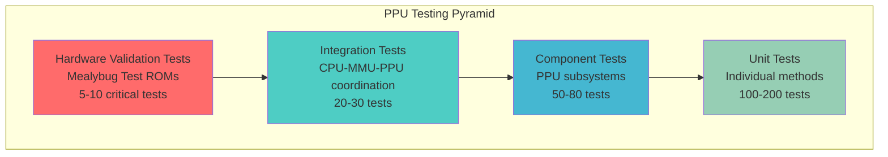

# PPU Testing Guide - Comprehensive Testing Strategy

**Document Version**: 1.0  
**Created**: 2025-08-11  
**Purpose**: Complete testing strategy and validation approach for PPU implementation  
**Target Audience**: Test Engineer, Implementation Teams, QA Engineers  
**Prerequisites**: `/home/pittm/karimono-v2/docs/PPU_TECHNICAL_ARCHITECTURE.md`

## Testing Strategy Overview

### Test-Driven Development Approach

The PPU implementation follows our established TDD workflow with hardware validation as the ultimate measure of correctness. Testing strategy emphasizes boundary observation, hardware accuracy verification, and systematic coverage of all PPU behaviors.

### Testing Pyramid Structure



### Boundary Observation Testing Principle

All PPU tests follow boundary observation methodology - testing components through observable side effects at encapsulation boundaries rather than implementation details.

```typescript
// Good: Test observable side effect
it('should block VRAM access during Mode 3', () => {
  ppu.writeVRAM(0x8000, 0x42);
  forceMode3(ppu);
  expect(ppu.readVRAM(0x8000)).toBe(0xFF); // Observable at boundary
});

// Bad: Test implementation detail
it('should set internal mode flag to 3', () => {
  ppu.step(cycles);
  expect(ppu.internalMode).toBe(3); // Testing internal state
});
```

## Unit Testing Strategy

### PPU Core Component Tests

#### State Machine Tests

```typescript
// tests/emulator/display/ppu/PPUStateMachine.test.ts

describe('PPU State Machine', () => {
  let stateMachine: PPUStateMachine;
  let mockRegisters: PPURegisters;

  beforeEach(() => {
    mockRegisters = createMockPPURegisters();
    stateMachine = new PPUStateMachine(mockRegisters);
  });

  describe('Mode Transitions', () => {
    it('should transition from Mode 2 to Mode 3 after 80 cycles', () => {
      // Start in Mode 2 (OAM Search)
      expect(stateMachine.getCurrentMode()).toBe(PPUMode.OAMSearch);
      expect(stateMachine.getCurrentScanline()).toBe(0);
      
      // Step exactly 80 cycles
      const events = stateMachine.step(80);
      
      // Should transition to Mode 3 (Pixel Transfer)
      expect(stateMachine.getCurrentMode()).toBe(PPUMode.PixelTransfer);
      expect(events.modeChanged).toBe(true);
    });

    it('should calculate variable Mode 3 duration based on SCX penalty', () => {
      // Set SCX to create timing penalty
      mockRegisters.SCX = 5; // Should add 5 cycle penalty
      
      // Step through Mode 2
      stateMachine.step(80);
      expect(stateMachine.getCurrentMode()).toBe(PPUMode.PixelTransfer);
      
      // Base Mode 3 duration (172) + SCX penalty (5) = 177 cycles
      stateMachine.step(177);
      
      // Should transition to Mode 0 (HBlank)
      expect(stateMachine.getCurrentMode()).toBe(PPUMode.HBlank);
    });

    it('should handle VBlank transition at scanline 144', () => {
      // Advance to scanline 144
      advanceToScanline(stateMachine, 144);
      
      const events = stateMachine.step(1);
      
      expect(stateMachine.getCurrentMode()).toBe(PPUMode.VBlank);
      expect(events.vblankInterrupt).toBe(true);
      expect(events.frameComplete).toBe(false); // Not yet complete
    });

    it('should complete frame after VBlank period', () => {
      // Advance through entire frame (70,224 cycles)
      let totalCycles = 0;
      let frameCompleteEvent = false;
      
      while (totalCycles < 70224) {
        const events = stateMachine.step(4);
        totalCycles += 4;
        
        if (events.frameComplete) {
          frameCompleteEvent = true;
          break;
        }
      }
      
      expect(frameCompleteEvent).toBe(true);
      expect(stateMachine.getFrameCycle()).toBe(0); // Reset for next frame
      expect(stateMachine.getCurrentScanline()).toBe(0);
    });
  });

  describe('Timing Accuracy', () => {
    it('should maintain exact scanline timing of 456 cycles', () => {
      let scanlineEvents = 0;
      let totalCycles = 0;
      
      // Step through multiple scanlines
      for (let cycles = 0; cycles < 456 * 5; cycles += 4) {
        const events = stateMachine.step(4);
        totalCycles += 4;
        
        if (events.scanlineComplete) {
          scanlineEvents++;
          
          // Each scanline should complete at exact 456 cycle intervals
          expect(totalCycles % 456).toBe(0);
        }
      }
      
      expect(scanlineEvents).toBe(5);
    });

    it('should handle window activation penalty correctly', () => {
      mockRegisters.isWindowEnabled.mockReturnValue(true);
      mockRegisters.WY = 50;
      
      // Advance to scanline where window activates
      advanceToScanline(stateMachine, 50);
      
      // Step through Mode 2
      stateMachine.step(80);
      
      // Mode 3 should include window penalty (6 additional cycles)
      const baseMode3 = 172;
      const windowPenalty = 6;
      
      stateMachine.step(baseMode3 + windowPenalty);
      expect(stateMachine.getCurrentMode()).toBe(PPUMode.HBlank);
    });
  });

  describe('Interrupt Generation', () => {
    it('should generate STAT interrupt for Mode 0 when enabled', () => {
      mockRegisters.STAT = 0x08; // Enable Mode 0 interrupt
      
      // Advance to HBlank
      advanceToMode(stateMachine, PPUMode.HBlank);
      
      const events = stateMachine.step(1);
      expect(events.statInterrupt).toBe(true);
    });

    it('should generate LYC=LY interrupt when scanlines match', () => {
      mockRegisters.LYC = 100;
      mockRegisters.STAT = 0x40; // Enable LYC interrupt
      
      advanceToScanline(stateMachine, 100);
      
      const events = stateMachine.step(1);
      expect(events.statInterrupt).toBe(true);
    });
  });
});
```

#### Memory Access Tests

```typescript
// tests/emulator/display/ppu/PPUMemoryAccess.test.ts

describe('PPU Memory Access', () => {
  let ppu: PPU;

  beforeEach(() => {
    ppu = new PPUImpl();
  });

  describe('VRAM Access Control', () => {
    it('should allow VRAM access during Mode 0, 1, 2', () => {
      const testData = 0x42;
      
      // Test in each accessible mode
      [PPUMode.HBlank, PPUMode.VBlank, PPUMode.OAMSearch].forEach(mode => {
        forceMode(ppu, mode);
        
        expect(ppu.isVRAMAccessible()).toBe(true);
        
        ppu.writeVRAM(0x8000, testData);
        expect(ppu.readVRAM(0x8000)).toBe(testData);
      });
    });

    it('should block VRAM access during Mode 3 (Pixel Transfer)', () => {
      const testData = 0x42;
      
      // Write data when accessible
      forceMode(ppu, PPUMode.HBlank);
      ppu.writeVRAM(0x8000, testData);
      
      // Switch to Mode 3
      forceMode(ppu, PPUMode.PixelTransfer);
      
      expect(ppu.isVRAMAccessible()).toBe(false);
      expect(ppu.readVRAM(0x8000)).toBe(0xFF); // Hardware behavior
      
      // Writes should be ignored
      ppu.writeVRAM(0x8000, 0x99);
      
      // Switch back to accessible mode - original data should remain
      forceMode(ppu, PPUMode.HBlank);
      expect(ppu.readVRAM(0x8000)).toBe(testData);
    });

    it('should validate VRAM address bounds', () => {
      expect(() => ppu.readVRAM(0x7FFF)).toThrow(); // Below VRAM
      expect(() => ppu.readVRAM(0xA000)).toThrow(); // Above VRAM
      expect(() => ppu.writeVRAM(0x7FFF, 0)).toThrow();
      expect(() => ppu.writeVRAM(0xA000, 0)).toThrow();
      
      // Valid addresses should not throw
      expect(() => ppu.readVRAM(0x8000)).not.toThrow();
      expect(() => ppu.readVRAM(0x9FFF)).not.toThrow();
      expect(() => ppu.writeVRAM(0x8000, 0)).not.toThrow();
      expect(() => ppu.writeVRAM(0x9FFF, 0)).not.toThrow();
    });
  });

  describe('OAM Access Control', () => {
    it('should allow OAM access during Mode 0 and 1 only', () => {
      const testData = 0x42;
      
      // Test accessible modes
      [PPUMode.HBlank, PPUMode.VBlank].forEach(mode => {
        forceMode(ppu, mode);
        
        expect(ppu.isOAMAccessible()).toBe(true);
        
        ppu.writeOAM(0xFE00, testData);
        expect(ppu.readOAM(0xFE00)).toBe(testData);
      });
    });

    it('should block OAM access during Mode 2 and 3', () => {
      const testData = 0x42;
      
      // Write data when accessible
      forceMode(ppu, PPUMode.HBlank);
      ppu.writeOAM(0xFE00, testData);
      
      // Test blocked modes
      [PPUMode.OAMSearch, PPUMode.PixelTransfer].forEach(mode => {
        forceMode(ppu, mode);
        
        expect(ppu.isOAMAccessible()).toBe(false);
        expect(ppu.readOAM(0xFE00)).toBe(0xFF);
        
        // Write should be ignored
        ppu.writeOAM(0xFE00, 0x99);
      });
      
      // Original data should remain when accessible again
      forceMode(ppu, PPUMode.HBlank);
      expect(ppu.readOAM(0xFE00)).toBe(testData);
    });

    it('should block OAM access during DMA transfer', () => {
      forceMode(ppu, PPUMode.HBlank); // Mode allows OAM access
      
      // Start DMA transfer
      ppu.writeRegister(0xFF46, 0xC0); // DMA from 0xC000
      
      expect(ppu.isDMAActive()).toBe(true);
      expect(ppu.isOAMAccessible()).toBe(false);
      
      // Access should be blocked even in normally accessible mode
      expect(ppu.readOAM(0xFE00)).toBe(0xFF);
    });
  });

  describe('Register Access', () => {
    it('should handle all PPU register addresses', () => {
      const registers = [
        0xFF40, 0xFF41, 0xFF42, 0xFF43, 0xFF44, 0xFF45,
        0xFF46, 0xFF47, 0xFF48, 0xFF49, 0xFF4A, 0xFF4B
      ];
      
      registers.forEach(address => {
        expect(() => ppu.readRegister(address)).not.toThrow();
        expect(() => ppu.writeRegister(address, 0x00)).not.toThrow();
      });
    });

    it('should enforce LY register read-only behavior', () => {
      const originalLY = ppu.readRegister(0xFF44);
      
      // Attempt to write to LY
      ppu.writeRegister(0xFF44, 0xFF);
      
      // Value should not change
      expect(ppu.readRegister(0xFF44)).toBe(originalLY);
    });

    it('should trigger DMA transfer on DMA register write', () => {
      expect(ppu.isDMAActive()).toBe(false);
      
      ppu.writeRegister(0xFF46, 0xC0); // DMA from 0xC000
      
      expect(ppu.isDMAActive()).toBe(true);
    });
  });
});
```

### Rendering Component Tests

#### Background Rendering Tests

```typescript
// tests/emulator/display/ppu/BackgroundRenderer.test.ts

describe('Background Rendering', () => {
  let ppu: PPU;
  
  beforeEach(() => {
    ppu = new PPUImpl();
    setupBasicVRAM(ppu);
  });

  describe('Tile Data Access', () => {
    it('should handle unsigned tile addressing (LCDC.4 = 1)', () => {
      // Set LCDC for unsigned addressing
      ppu.writeRegister(0xFF40, 0x90); // LCD on, unsigned addressing
      
      // Set up tile data at 0x8000
      setupTileData(ppu, 0x8000, SOLID_TILE_PATTERN);
      
      // Set tile map to reference tile 0
      ppu.writeVRAM(0x9800, 0x00); // Tile index 0
      
      // Render scanline 0
      renderScanline(ppu, 0);
      
      const frameBuffer = ppu.getFrameBuffer();
      
      // First 8 pixels should match tile pattern
      for (let x = 0; x < 8; x++) {
        expect(frameBuffer[x]).toBe(SOLID_TILE_PATTERN[x]);
      }
    });

    it('should handle signed tile addressing (LCDC.4 = 0)', () => {
      // Set LCDC for signed addressing
      ppu.writeRegister(0xFF40, 0x80); // LCD on, signed addressing
      
      // Set up tile data at 0x9000 (base for signed addressing)
      setupTileData(ppu, 0x9000, SOLID_TILE_PATTERN);
      
      // Set tile map to reference tile 0 (signed)
      ppu.writeVRAM(0x9800, 0x00);
      
      renderScanline(ppu, 0);
      
      const frameBuffer = ppu.getFrameBuffer();
      for (let x = 0; x < 8; x++) {
        expect(frameBuffer[x]).toBe(SOLID_TILE_PATTERN[x]);
      }
    });

    it('should handle negative tile indices in signed mode', () => {
      ppu.writeRegister(0xFF40, 0x80); // Signed addressing
      
      // Set up tile data at 0x8FF0 (tile -1 in signed addressing)
      setupTileData(ppu, 0x8FF0, SOLID_TILE_PATTERN);
      
      // Set tile map to reference tile -1 (0xFF in unsigned representation)
      ppu.writeVRAM(0x9800, 0xFF);
      
      renderScanline(ppu, 0);
      
      const frameBuffer = ppu.getFrameBuffer();
      for (let x = 0; x < 8; x++) {
        expect(frameBuffer[x]).toBe(SOLID_TILE_PATTERN[x]);
      }
    });
  });

  describe('Scrolling Behavior', () => {
    it('should apply SCX horizontal scrolling correctly', () => {
      setupScrollingTest(ppu);
      
      // Set SCX to 4 pixels
      ppu.writeRegister(0xFF43, 4); // SCX = 4
      
      renderScanline(ppu, 0);
      
      const frameBuffer = ppu.getFrameBuffer();
      
      // Pixels should be shifted by SCX offset
      expect(frameBuffer[0]).toBe(getExpectedScrolledPixel(4, 0));
      expect(frameBuffer[156]).toBe(getExpectedScrolledPixel(4, 156));
    });

    it('should apply SCY vertical scrolling correctly', () => {
      setupScrollingTest(ppu);
      
      // Set SCY to 2 pixels
      ppu.writeRegister(0xFF42, 2); // SCY = 2
      
      renderScanline(ppu, 0);
      
      const frameBuffer = ppu.getFrameBuffer();
      
      // Should render background as if scanline 2
      expect(frameBuffer[0]).toBe(getExpectedVerticallyScrolledPixel(2, 0, 0));
    });

    it('should handle scroll wrapping at tile map boundaries', () => {
      setupScrollingTest(ppu);
      
      // Set SCX to wrap around (256 - 4 = 252)
      ppu.writeRegister(0xFF43, 252); // SCX = 252
      
      renderScanline(ppu, 0);
      
      const frameBuffer = ppu.getFrameBuffer();
      
      // Should wrap around tile map
      expect(frameBuffer[0]).toBe(getWrappedScrollPixel(252, 0));
    });
  });

  describe('Tile Map Selection', () => {
    it('should use tile map at 0x9800 when LCDC.3 = 0', () => {
      ppu.writeRegister(0xFF40, 0x80); // LCDC.3 = 0
      
      // Set different patterns in each tile map
      ppu.writeVRAM(0x9800, 0x01); // Tile map 0
      ppu.writeVRAM(0x9C00, 0x02); // Tile map 1
      
      setupTileData(ppu, 0x8010, PATTERN_A); // Tile 1
      setupTileData(ppu, 0x8020, PATTERN_B); // Tile 2
      
      renderScanline(ppu, 0);
      
      // Should use tile 1 (from map 0)
      const frameBuffer = ppu.getFrameBuffer();
      expect(frameBuffer[0]).toBe(PATTERN_A[0]);
    });

    it('should use tile map at 0x9C00 when LCDC.3 = 1', () => {
      ppu.writeRegister(0xFF40, 0x88); // LCDC.3 = 1
      
      // Set different patterns in each tile map
      ppu.writeVRAM(0x9800, 0x01); // Tile map 0
      ppu.writeVRAM(0x9C00, 0x02); // Tile map 1
      
      setupTileData(ppu, 0x8010, PATTERN_A); // Tile 1
      setupTileData(ppu, 0x8020, PATTERN_B); // Tile 2
      
      renderScanline(ppu, 0);
      
      // Should use tile 2 (from map 1)
      const frameBuffer = ppu.getFrameBuffer();
      expect(frameBuffer[0]).toBe(PATTERN_B[0]);
    });
  });

  describe('Palette Application', () => {
    it('should apply BGP palette correctly', () => {
      setupTileWithAllColors(ppu);
      
      // Set custom palette: 0=white, 1=light, 2=dark, 3=black  
      ppu.writeRegister(0xFF47, 0b11100100); // BGP
      
      renderScanline(ppu, 0);
      
      const frameBuffer = ppu.getFrameBuffer();
      
      // Verify palette application
      expect(frameBuffer[0]).toBe(0b00); // Color 0 -> palette entry 0
      expect(frameBuffer[1]).toBe(0b01); // Color 1 -> palette entry 1
      expect(frameBuffer[2]).toBe(0b10); // Color 2 -> palette entry 2
      expect(frameBuffer[3]).toBe(0b11); // Color 3 -> palette entry 3
    });
  });
});
```

## Component Integration Tests

### PPU-MMU Integration Tests

```typescript
// tests/emulator/display/integration/PPU-MMU.test.ts

describe('PPU-MMU Integration', () => {
  let emulator: EmulatorContainer;
  let mmu: MMU;
  let ppu: PPU;

  beforeEach(() => {
    emulator = new EmulatorContainer(document.createElement('div'));
    mmu = emulator.getMMU();
    ppu = emulator.getPPU();
  });

  describe('Memory Routing', () => {
    it('should route VRAM addresses to PPU', () => {
      const testData = 0x42;
      
      // Write through MMU should reach PPU
      mmu.write(0x8000, testData);
      expect(ppu.readVRAM(0x8000)).toBe(testData);
      
      // Read through MMU should come from PPU
      expect(mmu.read(0x8000)).toBe(testData);
    });

    it('should route OAM addresses to PPU', () => {
      const testData = 0x42;
      
      // Force accessible mode
      forceMode(ppu, PPUMode.HBlank);
      
      mmu.write(0xFE00, testData);
      expect(ppu.readOAM(0xFE00)).toBe(testData);
      expect(mmu.read(0xFE00)).toBe(testData);
    });

    it('should route PPU register addresses to PPU', () => {
      const testData = 0x80; // Valid LCDC value
      
      mmu.write(0xFF40, testData);
      expect(ppu.readRegister(0xFF40)).toBe(testData);
      expect(mmu.read(0xFF40)).toBe(testData);
    });

    it('should respect PPU memory access restrictions', () => {
      const testData = 0x42;
      
      // Write when accessible
      forceMode(ppu, PPUMode.HBlank);
      mmu.write(0x8000, testData);
      
      // Read when blocked should return 0xFF
      forceMode(ppu, PPUMode.PixelTransfer);
      expect(mmu.read(0x8000)).toBe(0xFF);
      
      // Direct PPU access should also be blocked
      expect(ppu.readVRAM(0x8000)).toBe(0xFF);
    });
  });

  describe('DMA Integration', () => {
    it('should coordinate DMA transfer between MMU and PPU', () => {
      // Set up source data in RAM
      for (let i = 0; i < 160; i++) {
        mmu.write(0xC000 + i, i & 0xFF);
      }
      
      // Trigger DMA transfer
      mmu.write(0xFF46, 0xC0); // DMA source = 0xC000
      
      expect(ppu.isDMAActive()).toBe(true);
      
      // Step emulator to complete DMA (160 cycles)
      for (let i = 0; i < 160; i++) {
        emulator.step(); // Step CPU/PPU
      }
      
      // Verify data was copied to OAM
      for (let i = 0; i < 160; i++) {
        expect(ppu.readOAM(0xFE00 + i)).toBe(i & 0xFF);
      }
      
      expect(ppu.isDMAActive()).toBe(false);
    });

    it('should block CPU access to all memory during DMA except HRAM', () => {
      // Start DMA transfer
      mmu.write(0xFF46, 0xC0);
      
      expect(ppu.isDMAActive()).toBe(true);
      
      // CPU should only be able to access HRAM (0xFF80-0xFFFE)
      expect(mmu.isCPUAccessAllowed(0x0000)).toBe(false); // ROM
      expect(mmu.isCPUAccessAllowed(0x8000)).toBe(false); // VRAM
      expect(mmu.isCPUAccessAllowed(0xC000)).toBe(false); // RAM
      expect(mmu.isCPUAccessAllowed(0xFF80)).toBe(true);  // HRAM
      expect(mmu.isCPUAccessAllowed(0xFFFE)).toBe(true);  // IE register
    });
  });

  describe('Address Space Validation', () => {
    it('should handle invalid PPU addresses gracefully', () => {
      // Invalid VRAM addresses
      expect(() => mmu.read(0x7FFF)).not.toThrow();  // Should route elsewhere
      expect(() => mmu.read(0xA000)).not.toThrow();  // Should route elsewhere
      
      // Invalid OAM addresses  
      expect(() => mmu.read(0xFDFF)).not.toThrow();  // Should route elsewhere
      expect(() => mmu.read(0xFEA0)).not.toThrow();  // Should route elsewhere
      
      // Invalid register addresses
      expect(() => mmu.read(0xFF3F)).not.toThrow();  // Should route elsewhere
      expect(() => mmu.read(0xFF4C)).not.toThrow();  // Should route elsewhere
    });
  });
});
```

### CPU-PPU Coordination Tests

```typescript
// tests/emulator/display/integration/CPU-PPU.test.ts

describe('CPU-PPU Coordination', () => {
  let emulator: EmulatorContainer;
  let cpu: CPU;
  let ppu: PPU;

  beforeEach(() => {
    emulator = new EmulatorContainer(document.createElement('div'));
    cpu = emulator.getCPU();
    ppu = emulator.getPPU();
  });

  describe('Cycle Coordination', () => {
    it('should advance PPU with CPU cycles', () => {
      const initialFrameCycle = ppu.getFrameCycle();
      
      // Execute CPU instruction (4 cycles)
      cpu.executeInstruction(0x00); // NOP
      
      expect(ppu.getFrameCycle()).toBe(initialFrameCycle + 4);
    });

    it('should coordinate frame timing with CPU execution', () => {
      let frameCompleteCount = 0;
      
      // Monitor frame completion
      emulator.onFrameComplete(() => frameCompleteCount++);
      
      // Execute full frame worth of cycles
      let totalCycles = 0;
      while (totalCycles < 70224) {
        cpu.executeInstruction(0x00); // NOP (4 cycles)
        totalCycles += 4;
      }
      
      expect(frameCompleteCount).toBe(1);
    });

    it('should maintain consistent timing across multiple frames', () => {
      const frameStartCycles: number[] = [];
      
      emulator.onFrameComplete(() => {
        frameStartCycles.push(cpu.getTotalCycles());
      });
      
      // Run for 3 frames
      let totalCycles = 0;
      while (frameStartCycles.length < 3) {
        cpu.executeInstruction(0x00); // NOP
        totalCycles += 4;
      }
      
      // Frame intervals should be exactly 70,224 cycles
      expect(frameStartCycles[1] - frameStartCycles[0]).toBe(70224);
      expect(frameStartCycles[2] - frameStartCycles[1]).toBe(70224);
    });
  });

  describe('Interrupt Coordination', () => {
    it('should generate VBlank interrupt at correct timing', () => {
      let vblankInterrupts = 0;
      
      cpu.getInterruptController().onInterrupt(InterruptType.VBlank, () => {
        vblankInterrupts++;
      });
      
      // Advance to VBlank period
      advanceToScanline(ppu, 144);
      
      expect(vblankInterrupts).toBe(1);
    });

    it('should generate STAT interrupts based on register configuration', () => {
      let statInterrupts = 0;
      
      // Enable Mode 0 (HBlank) interrupt
      ppu.writeRegister(0xFF41, 0x08);
      
      cpu.getInterruptController().onInterrupt(InterruptType.STAT, () => {
        statInterrupts++;
      });
      
      // Advance to HBlank mode
      advanceToMode(ppu, PPUMode.HBlank);
      
      expect(statInterrupts).toBeGreaterThan(0);
    });

    it('should handle LYC=LY interrupt correctly', () => {
      let lycInterrupts = 0;
      
      // Set LYC and enable interrupt
      ppu.writeRegister(0xFF45, 100); // LYC = 100
      ppu.writeRegister(0xFF41, 0x40); // Enable LYC interrupt
      
      cpu.getInterruptController().onInterrupt(InterruptType.STAT, () => {
        lycInterrupts++;
      });
      
      // Advance to matching scanline
      advanceToScanline(ppu, 100);
      
      expect(lycInterrupts).toBe(1);
    });
  });

  describe('Memory Access Coordination', () => {
    it('should block CPU memory access during PPU busy periods', () => {
      // Force PPU into Mode 3 (blocks VRAM)
      forceMode(ppu, PPUMode.PixelTransfer);
      
      // CPU attempt to access VRAM should be blocked
      const blockedRead = cpu.read(0x8000);
      expect(blockedRead).toBe(0xFF);
      
      // CPU write should be ignored
      cpu.write(0x8000, 0x42);
      
      // Switch to accessible mode - data should not have changed
      forceMode(ppu, PPUMode.HBlank);
      expect(cpu.read(0x8000)).toBe(0x00); // Default value
    });

    it('should allow CPU access during appropriate PPU modes', () => {
      // Test all accessible modes
      const accessibleModes = [PPUMode.HBlank, PPUMode.VBlank];
      
      accessibleModes.forEach(mode => {
        forceMode(ppu, mode);
        
        // CPU should be able to access VRAM
        cpu.write(0x8000, 0x42);
        expect(cpu.read(0x8000)).toBe(0x42);
        
        // CPU should be able to access OAM (except Mode 2)
        if (mode !== PPUMode.OAMSearch) {
          cpu.write(0xFE00, 0x99);
          expect(cpu.read(0xFE00)).toBe(0x99);
        }
      });
    });
  });

  describe('Performance Coordination', () => {
    it('should maintain target frame rate during CPU execution', () => {
      const targetFPS = 59.7;
      const frameTimeMS = 1000 / targetFPS;
      
      const startTime = performance.now();
      let frameCount = 0;
      
      // Run for approximately 1 second
      const testDuration = 1000; // 1 second
      while ((performance.now() - startTime) < testDuration) {
        // Execute frame worth of instructions
        let frameCycles = 0;
        while (frameCycles < 70224) {
          cpu.executeInstruction(0x00); // NOP
          frameCycles += 4;
        }
        frameCount++;
      }
      
      const actualTime = performance.now() - startTime;
      const actualFPS = frameCount / (actualTime / 1000);
      
      // Should be close to target FPS (within 10%)
      expect(actualFPS).toBeGreaterThan(targetFPS * 0.9);
      expect(actualFPS).toBeLessThan(targetFPS * 1.1);
    });
  });
});
```

## Hardware Validation Testing

### Mealybug Test ROM Integration

```typescript
// tests/emulator/display/validation/MealybugPPUTests.test.ts

describe('Mealybug PPU Hardware Validation', () => {
  let emulator: EmulatorContainer;
  
  beforeEach(() => {
    emulator = new EmulatorContainer(document.createElement('div'));
  });

  describe('Timing Tests', () => {
    it('should pass m3_window_timing test', async () => {
      const testROM = await loadTestROM('mealybug/m3_window_timing.gb');
      const expectedOutput = await loadExpectedOutput('mealybug/expected/DMG-blob/m3_window_timing.png');
      
      emulator.loadROM(testROM);
      
      // Run until test completion
      const result = await runUntilTestComplete(emulator, 10000); // 10 second timeout
      
      expect(result.completed).toBe(true);
      expect(result.success).toBe(true);
      
      // Compare pixel-perfect output
      const actualOutput = emulator.captureScreenshot();
      expect(compareImages(actualOutput, expectedOutput)).toBe(true);
    });

    it('should pass m3_scx_low_3_bits test', async () => {
      const testROM = await loadTestROM('mealybug/m3_scx_low_3_bits.gb');
      const expectedOutput = await loadExpectedOutput('mealybug/expected/DMG-blob/m3_scx_low_3_bits.png');
      
      emulator.loadROM(testROM);
      
      const result = await runUntilTestComplete(emulator);
      
      expect(result.completed).toBe(true);
      expect(result.success).toBe(true);
      
      const actualOutput = emulator.captureScreenshot();
      expect(compareImages(actualOutput, expectedOutput)).toBe(true);
    });

    it('should pass m2_win_en_toggle test', async () => {
      const testROM = await loadTestROM('mealybug/m2_win_en_toggle.gb');
      const expectedOutput = await loadExpectedOutput('mealybug/expected/DMG-blob/m2_win_en_toggle.png');
      
      emulator.loadROM(testROM);
      
      const result = await runUntilTestComplete(emulator);
      
      expect(result.completed).toBe(true);
      expect(result.success).toBe(true);
      
      const actualOutput = emulator.captureScreenshot();
      expect(compareImages(actualOutput, expectedOutput)).toBe(true);
    });
  });

  describe('Register Change Tests', () => {
    it('should pass m3_bgp_change test', async () => {
      const testROM = await loadTestROM('mealybug/m3_bgp_change.gb');
      const expectedOutput = await loadExpectedOutput('mealybug/expected/DMG-blob/m3_bgp_change.png');
      
      emulator.loadROM(testROM);
      
      const result = await runUntilTestComplete(emulator);
      
      expect(result.completed).toBe(true);
      const actualOutput = emulator.captureScreenshot();
      expect(compareImages(actualOutput, expectedOutput)).toBe(true);
    });

    it('should pass m3_lcdc_tile_sel_change test', async () => {
      const testROM = await loadTestROM('mealybug/m3_lcdc_tile_sel_change.gb');
      const expectedOutput = await loadExpectedOutput('mealybug/expected/DMG-blob/m3_lcdc_tile_sel_change.png');
      
      emulator.loadROM(testROM);
      
      const result = await runUntilTestComplete(emulator);
      
      expect(result.completed).toBe(true);
      const actualOutput = emulator.captureScreenshot();
      expect(compareImages(actualOutput, expectedOutput)).toBe(true);
    });

    it('should pass m3_lcdc_bg_map_change test', async () => {
      const testROM = await loadTestROM('mealybug/m3_lcdc_bg_map_change.gb');
      const expectedOutput = await loadExpectedOutput('mealybug/expected/DMG-blob/m3_lcdc_bg_map_change.png');
      
      emulator.loadROM(testROM);
      
      const result = await runUntilTestComplete(emulator);
      
      expect(result.completed).toBe(true);
      const actualOutput = emulator.captureScreenshot();
      expect(compareImages(actualOutput, expectedOutput)).toBe(true);
    });
  });

  describe('Rendering Tests', () => {
    it('should pass m3_wx_4_change_sprites test', async () => {
      const testROM = await loadTestROM('mealybug/m3_wx_4_change_sprites.gb');
      const expectedOutput = await loadExpectedOutput('mealybug/expected/DMG-blob/m3_wx_4_change_sprites.png');
      
      emulator.loadROM(testROM);
      
      const result = await runUntilTestComplete(emulator);
      
      expect(result.completed).toBe(true);
      const actualOutput = emulator.captureScreenshot();
      expect(compareImages(actualOutput, expectedOutput)).toBe(true);
    });

    it('should pass m3_lcdc_obj_size_change test', async () => {
      const testROM = await loadTestROM('mealybug/m3_lcdc_obj_size_change.gb');
      const expectedOutput = await loadExpectedOutput('mealybug/expected/DMG-blob/m3_lcdc_obj_size_change.png');
      
      emulator.loadROM(testROM);
      
      const result = await runUntilTestComplete(emulator);
      
      expect(result.completed).toBe(true);
      const actualOutput = emulator.captureScreenshot();
      expect(compareImages(actualOutput, expectedOutput)).toBe(true);
    });
  });
});
```

### Screenshot Testing Framework

```typescript
// tests/utils/ScreenshotTesting.ts

/**
 * Screenshot Testing Utilities for PPU Validation
 * 
 * Provides pixel-perfect comparison capabilities for hardware validation
 */

export interface ScreenshotTestResult {
  match: boolean;
  differenceCount: number;
  maxDifference: number;
  differenceImage?: ImageData;
}

export class ScreenshotTester {
  /**
   * Compare two images pixel by pixel
   * @param actual - Actual emulator output
   * @param expected - Expected reference image
   * @param tolerance - Pixel difference tolerance (0 = exact match)
   */
  compareImages(
    actual: ImageData,
    expected: ImageData,
    tolerance: number = 0
  ): ScreenshotTestResult {
    if (actual.width !== expected.width || actual.height !== expected.height) {
      throw new Error('Image dimensions do not match');
    }
    
    let differenceCount = 0;
    let maxDifference = 0;
    const differenceData = new Uint8ClampedArray(actual.data.length);
    
    for (let i = 0; i < actual.data.length; i += 4) {
      const rDiff = Math.abs(actual.data[i] - expected.data[i]);
      const gDiff = Math.abs(actual.data[i + 1] - expected.data[i + 1]);
      const bDiff = Math.abs(actual.data[i + 2] - expected.data[i + 2]);
      
      const totalDiff = rDiff + gDiff + bDiff;
      
      if (totalDiff > tolerance) {
        differenceCount++;
        maxDifference = Math.max(maxDifference, totalDiff);
        
        // Highlight difference in red
        differenceData[i] = 255;     // R
        differenceData[i + 1] = 0;   // G
        differenceData[i + 2] = 0;   // B
        differenceData[i + 3] = 255; // A
      } else {
        // Copy original pixel
        differenceData[i] = actual.data[i];
        differenceData[i + 1] = actual.data[i + 1];
        differenceData[i + 2] = actual.data[i + 2];
        differenceData[i + 3] = actual.data[i + 3];
      }
    }
    
    return {
      match: differenceCount === 0,
      differenceCount,
      maxDifference,
      differenceImage: differenceCount > 0 ? new ImageData(differenceData, actual.width) : undefined
    };
  }
  
  /**
   * Save difference image for debugging
   */
  saveDifferenceImage(result: ScreenshotTestResult, filename: string): void {
    if (!result.differenceImage) return;
    
    // Implementation would save to filesystem for debugging
    console.log(`Difference image saved to: ${filename}`);
    console.log(`Differences found: ${result.differenceCount} pixels`);
    console.log(`Maximum difference: ${result.maxDifference}`);
  }
  
  /**
   * Generate test report for failed screenshot tests
   */
  generateTestReport(results: Map<string, ScreenshotTestResult>): string {
    const report: string[] = ['PPU Screenshot Test Report', '='.repeat(30), ''];
    
    let totalTests = 0;
    let passedTests = 0;
    
    results.forEach((result, testName) => {
      totalTests++;
      if (result.match) {
        passedTests++;
        report.push(`✓ ${testName} - PASSED`);
      } else {
        report.push(`✗ ${testName} - FAILED (${result.differenceCount} pixel differences)`);
      }
    });
    
    report.push('', `Summary: ${passedTests}/${totalTests} tests passed`);
    
    if (passedTests < totalTests) {
      report.push('', 'Hardware accuracy issues detected!');
      report.push('Review difference images and PPU implementation.');
    }
    
    return report.join('\n');
  }
}
```

## Performance Testing Strategy

### Frame Rate Testing

```typescript
// tests/emulator/display/performance/FrameRateTests.test.ts

describe('PPU Performance Tests', () => {
  let emulator: EmulatorContainer;
  
  beforeEach(() => {
    emulator = new EmulatorContainer(document.createElement('div'));
  });

  describe('Frame Rate Performance', () => {
    it('should maintain target 59.7 FPS under normal load', async () => {
      const targetFPS = 59.7;
      const testDuration = 5000; // 5 seconds
      
      // Load test ROM with complex graphics
      const complexROM = createComplexGraphicsTestROM();
      emulator.loadROM(complexROM);
      
      const frameCounter = new FrameRateCounter();
      emulator.onFrameComplete(() => frameCounter.recordFrame());
      
      emulator.start();
      
      await sleep(testDuration);
      
      emulator.stop();
      
      const averageFPS = frameCounter.getAverageFPS();
      const minFPS = frameCounter.getMinFPS();
      
      expect(averageFPS).toBeGreaterThan(targetFPS * 0.95); // Within 5%
      expect(minFPS).toBeGreaterThan(targetFPS * 0.85); // Min should be within 15%
    });

    it('should handle maximum sprite load without performance degradation', async () => {
      // Set up scenario with 10 sprites per scanline (hardware maximum)
      const spriteHeavyROM = createMaxSpriteTestROM();
      emulator.loadROM(spriteHeavyROM);
      
      const performanceMonitor = new PPUPerformanceMonitor();
      
      // Run for sufficient time to measure stable performance
      const testFrames = 300; // ~5 seconds at 60 FPS
      let frameCount = 0;
      
      emulator.onFrameComplete(() => {
        frameCount++;
        performanceMonitor.recordFrameTiming();
      });
      
      emulator.start();
      
      while (frameCount < testFrames) {
        await sleep(16); // ~60 FPS
      }
      
      emulator.stop();
      
      const stats = performanceMonitor.getStats();
      expect(stats.averageFrameTime).toBeLessThan(16.75); // Target frame time
      expect(stats.frameTimeVariance).toBeLessThan(2.0); // Low variance
    });

    it('should maintain performance with complex scrolling', async () => {
      const scrollingTestROM = createScrollingTestROM();
      emulator.loadROM(scrollingTestROM);
      
      const performanceMonitor = new PPUPerformanceMonitor();
      
      // Test different scroll speeds
      const scrollSpeeds = [1, 2, 4, 8]; // Pixels per frame
      
      for (const speed of scrollSpeeds) {
        configureScrollSpeed(scrollingTestROM, speed);
        
        const testFrames = 120; // 2 seconds
        let frameCount = 0;
        
        performanceMonitor.reset();
        
        emulator.onFrameComplete(() => {
          frameCount++;
          performanceMonitor.recordFrameTiming();
        });
        
        emulator.start();
        
        while (frameCount < testFrames) {
          await sleep(16);
        }
        
        emulator.stop();
        
        const stats = performanceMonitor.getStats();
        expect(stats.averageFrameTime).toBeLessThan(16.75);
      }
    });
  });

  describe('Memory Performance', () => {
    it('should optimize buffer allocation for rendering', () => {
      const ppu = emulator.getPPU();
      const performanceStats = ppu.getPerformanceStats();
      
      // Render multiple frames
      for (let frame = 0; frame < 60; frame++) {
        renderFullFrame(ppu);
      }
      
      const finalStats = ppu.getPerformanceStats();
      
      // Should show high buffer reuse ratio
      const reuseRatio = finalStats.bufferReuses / finalStats.allocations;
      expect(reuseRatio).toBeGreaterThan(10); // At least 10:1 reuse ratio
    });

    it('should minimize garbage collection during rendering', () => {
      const ppu = emulator.getPPU();
      
      // Force garbage collection before test
      if (global.gc) global.gc();
      
      const initialMemory = process.memoryUsage().heapUsed;
      
      // Render many frames
      for (let frame = 0; frame < 300; frame++) {
        renderFullFrame(ppu);
      }
      
      const finalMemory = process.memoryUsage().heapUsed;
      const memoryIncrease = finalMemory - initialMemory;
      
      // Memory increase should be minimal (< 10MB for 300 frames)
      expect(memoryIncrease).toBeLessThan(10 * 1024 * 1024);
    });
  });

  describe('Scalability Testing', () => {
    it('should handle multiple emulator instances efficiently', async () => {
      const instanceCount = 4;
      const emulators: EmulatorContainer[] = [];
      
      // Create multiple emulator instances
      for (let i = 0; i < instanceCount; i++) {
        const container = document.createElement('div');
        const emulator = new EmulatorContainer(container);
        emulator.loadROM(createTestROM());
        emulators.push(emulator);
      }
      
      const performanceMonitor = new PerformanceMonitor();
      
      // Start all emulators
      emulators.forEach(emulator => {
        emulator.onFrameComplete(() => performanceMonitor.recordFrame());
        emulator.start();
      });
      
      // Run for test duration
      await sleep(3000);
      
      // Stop all emulators
      emulators.forEach(emulator => emulator.stop());
      
      const stats = performanceMonitor.getStats();
      
      // Each emulator should still maintain reasonable frame rate
      const averageFPSPerInstance = stats.totalFrameRate / instanceCount;
      expect(averageFPSPerInstance).toBeGreaterThan(45); // At least 45 FPS each
      
      // Clean up
      emulators.forEach(emulator => emulator.destroy());
    });
  });
});
```

## Test Utilities and Helpers

### PPU Test Utilities

```typescript
// tests/utils/PPUTestUtils.ts

/**
 * PPU Testing Utilities
 * 
 * Common utilities for PPU component testing
 */

export class PPUTestUtils {
  /**
   * Force PPU into specific mode for testing
   */
  static forceMode(ppu: PPU, mode: PPUMode): void {
    // Implementation depends on PPU internal structure
    // May require test-only methods on PPU class
    (ppu as any).forceMode(mode);
  }
  
  /**
   * Advance PPU to specific scanline
   */
  static advanceToScanline(ppu: PPU, targetScanline: number): void {
    while (ppu.getCurrentScanline() !== targetScanline) {
      ppu.step(4);
      
      // Safety check to prevent infinite loops
      if (ppu.getFrameCycle() > 70224 * 2) {
        throw new Error(`Could not advance to scanline ${targetScanline}`);
      }
    }
  }
  
  /**
   * Render complete frame
   */
  static renderFullFrame(ppu: PPU): void {
    const startFrame = ppu.getFrameCycle();
    
    while (ppu.getFrameCycle() >= startFrame && ppu.getFrameCycle() < 70224) {
      ppu.step(4);
    }
  }
  
  /**
   * Set up test tile data
   */
  static setupTileData(ppu: PPU, address: number, pattern: number[]): void {
    for (let i = 0; i < pattern.length; i++) {
      ppu.writeVRAM(address + i, pattern[i]);
    }
  }
  
  /**
   * Create test patterns
   */
  static readonly TEST_PATTERNS = {
    SOLID_WHITE: new Array(16).fill(0x00),
    SOLID_BLACK: new Array(16).fill(0xFF),
    CHECKERBOARD: [0xAA, 0x55, 0xAA, 0x55, 0xAA, 0x55, 0xAA, 0x55, 
                   0xAA, 0x55, 0xAA, 0x55, 0xAA, 0x55, 0xAA, 0x55],
    GRADIENT: [0x00, 0x00, 0x11, 0x11, 0x22, 0x22, 0x33, 0x33,
               0x44, 0x44, 0x55, 0x55, 0x66, 0x66, 0x77, 0x77],
  };
  
  /**
   * Validate frame buffer content
   */
  static validateFrameBuffer(
    frameBuffer: Uint8Array,
    validator: (pixel: number, x: number, y: number) => boolean
  ): boolean {
    for (let y = 0; y < 144; y++) {
      for (let x = 0; x < 160; x++) {
        const index = y * 160 + x;
        const pixel = frameBuffer[index];
        
        if (!validator(pixel, x, y)) {
          console.error(`Validation failed at pixel (${x}, ${y}): expected different value, got ${pixel}`);
          return false;
        }
      }
    }
    return true;
  }
  
  /**
   * Create mock PPU registers for testing
   */
  static createMockPPURegisters(): PPURegisters {
    return {
      read: jest.fn().mockReturnValue(0),
      write: jest.fn().mockReturnValue(false),
      reset: jest.fn(),
      
      LCDC: 0x91,
      STAT: 0x85,
      SCY: 0,
      SCX: 0,
      LY: 0,
      LYC: 0,
      BGP: 0xFC,
      OBP0: 0xFF,
      OBP1: 0xFF,
      WY: 0,
      WX: 7,
      
      isLCDEnabled: jest.fn().mockReturnValue(true),
      getWindowTileMapBase: jest.fn().mockReturnValue(0x9800),
      isWindowEnabled: jest.fn().mockReturnValue(false),
      getTileDataBase: jest.fn().mockReturnValue(0x8000),
      isTileDataUnsigned: jest.fn().mockReturnValue(true),
      getBackgroundTileMapBase: jest.fn().mockReturnValue(0x9800),
      getSpriteSize: jest.fn().mockReturnValue(8),
      isSpritesEnabled: jest.fn().mockReturnValue(true),
      isBackgroundEnabled: jest.fn().mockReturnValue(true),
    } as PPURegisters;
  }
}

/**
 * Frame rate monitoring utility
 */
export class FrameRateCounter {
  private frameTimestamps: number[] = [];
  
  recordFrame(): void {
    this.frameTimestamps.push(performance.now());
    
    // Keep only last 60 frames for rolling average
    if (this.frameTimestamps.length > 60) {
      this.frameTimestamps.shift();
    }
  }
  
  getAverageFPS(): number {
    if (this.frameTimestamps.length < 2) return 0;
    
    const timeSpan = this.frameTimestamps[this.frameTimestamps.length - 1] - this.frameTimestamps[0];
    const frameCount = this.frameTimestamps.length - 1;
    
    return (frameCount / timeSpan) * 1000;
  }
  
  getMinFPS(): number {
    if (this.frameTimestamps.length < 2) return 0;
    
    let maxInterval = 0;
    
    for (let i = 1; i < this.frameTimestamps.length; i++) {
      const interval = this.frameTimestamps[i] - this.frameTimestamps[i - 1];
      maxInterval = Math.max(maxInterval, interval);
    }
    
    return maxInterval > 0 ? 1000 / maxInterval : 0;
  }
}
```

## Test Execution and Reporting

### Continuous Integration Setup

```bash
# scripts/test-ppu.sh
#!/bin/bash

echo "Running PPU Test Suite..."
echo "========================"

# Unit tests
echo "1. Running PPU unit tests..."
npm test -- tests/emulator/display/ppu/ --verbose --coverage

# Integration tests
echo "2. Running PPU integration tests..."
npm test -- tests/emulator/display/integration/ --verbose

# Performance tests
echo "3. Running PPU performance tests..."
npm test -- tests/emulator/display/performance/ --verbose

# Hardware validation tests (if test ROMs available)
if [ -d "tests/resources/mealybug" ]; then
  echo "4. Running Mealybug hardware validation tests..."
  npm test -- tests/emulator/display/validation/ --verbose --timeout=30000
else
  echo "4. Skipping Mealybug tests (test ROMs not found)"
fi

# Generate combined test report
echo "5. Generating test report..."
npm run test:report

echo "PPU test suite complete!"
```

### Test Reporting

```typescript
// tests/utils/TestReporting.ts

export interface PPUTestReport {
  summary: {
    totalTests: number;
    passedTests: number;
    failedTests: number;
    skippedTests: number;
    coverage: number;
  };
  
  categories: {
    unit: TestCategoryResult;
    integration: TestCategoryResult;
    performance: TestCategoryResult;
    hardware: TestCategoryResult;
  };
  
  recommendations: string[];
  issues: TestIssue[];
}

export interface TestCategoryResult {
  passed: number;
  failed: number;
  skipped: number;
  duration: number;
  coverage: number;
}

export interface TestIssue {
  severity: 'low' | 'medium' | 'high' | 'critical';
  category: string;
  description: string;
  file: string;
  line?: number;
}

export class PPUTestReporter {
  generateReport(results: JestResults): PPUTestReport {
    // Implementation would parse Jest results and generate comprehensive report
    
    return {
      summary: this.generateSummary(results),
      categories: this.categorizeResults(results),
      recommendations: this.generateRecommendations(results),
      issues: this.identifyIssues(results),
    };
  }
  
  generateHTMLReport(report: PPUTestReport): string {
    // Generate HTML test report for human review
    return `
      <html>
        <head><title>PPU Test Report</title></head>
        <body>
          <h1>PPU Implementation Test Report</h1>
          <div class="summary">
            <h2>Summary</h2>
            <p>Total Tests: ${report.summary.totalTests}</p>
            <p>Passed: ${report.summary.passedTests}</p>
            <p>Failed: ${report.summary.failedTests}</p>
            <p>Coverage: ${report.summary.coverage}%</p>
          </div>
          <!-- Additional sections... -->
        </body>
      </html>
    `;
  }
}
```

## Quality Gates and Success Criteria

### Phase Completion Criteria

Each PPU implementation phase must meet these testing criteria:

#### Phase 1: Core Infrastructure
- [ ] All PPU core component unit tests pass
- [ ] PPU state machine timing tests pass
- [ ] Memory access control tests pass
- [ ] Register implementation tests pass
- [ ] No memory leaks in buffer allocation
- [ ] TypeScript strict mode compliance

#### Phase 2: Rendering Implementation
- [ ] Background rendering tests pass
- [ ] Window layer tests pass
- [ ] Sprite rendering tests pass (basic)
- [ ] Layer mixing tests pass
- [ ] Palette application tests pass
- [ ] Frame buffer generation tests pass

#### Phase 3: Integration
- [ ] PPU-MMU integration tests pass
- [ ] CPU-PPU coordination tests pass
- [ ] Interrupt generation tests pass
- [ ] DMA coordination tests pass
- [ ] No regression in existing Blargg CPU tests
- [ ] Performance maintains target frame rate

#### Phase 4: Hardware Validation
- [ ] **All Mealybug PPU tests pass with pixel-perfect output**
- [ ] Hardware timing tests pass
- [ ] Edge case behavior tests pass
- [ ] Complex ROM compatibility tests pass
- [ ] Performance under maximum load tests pass

### Quality Assurance Checklist

- [ ] **Hardware Accuracy**: All Mealybug test ROMs pass
- [ ] **Performance**: Sustained 59.7 FPS frame rate
- [ ] **Integration**: No regression in existing tests
- [ ] **Code Quality**: TypeScript strict mode, ESLint compliance
- [ ] **Test Coverage**: >90% line coverage for PPU components
- [ ] **Documentation**: All APIs documented with JSDoc
- [ ] **Boundary Testing**: Components tested through observable effects
- [ ] **Error Handling**: Graceful handling of all error conditions

---

**Implementation Requirements**:
1. Follow TDD workflow - write tests first
2. Use boundary observation testing methodology
3. Validate against hardware test ROMs
4. Maintain performance targets throughout development
5. Ensure integration compatibility with existing systems

**Success Metrics**:
- 100% pass rate on Mealybug PPU test suite
- Sustained target frame rate performance  
- Zero regression in existing CPU/MMU/Timer tests
- Complete API coverage with comprehensive test suite
- Hardware-accurate timing and behavior validation

**References**:
- RGBDS GBZ80 Reference: https://rgbds.gbdev.io/docs/v0.9.4/gbz80.7 (Required primary source)
- `/home/pittm/karimono-v2/tests/resources/mealybug/` - Hardware validation test suite
- `/home/pittm/karimono-v2/docs/PPU_TECHNICAL_ARCHITECTURE.md` - System architecture
- `/home/pittm/karimono-v2/docs/hardware/ppu-comprehensive-specification.md` - Hardware specifications